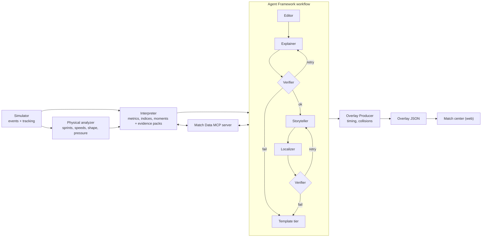

# MatchMind

**Explained, personalized football match intelligence from synthetic events.**
Built for the Microsoft × Premier League *Inside the Game* developer hackathon.


Football stories do not end at the scoreline. MatchMind ingests a stream of synthetic match events and
tracking, works out *what changed and why it matters*, and delivers it as timed on-screen graphics and
recaps that read differently for an analyst and a casual fan, in English, Spanish or Turkish. Every
number in every sentence is traced to computed evidence and checked by code before it reaches the screen.

All data is synthetic. The league, clubs, crests and players are fictional.

## The pipeline

| Stage | What happens | Where |
|---|---|---|
| **Ingest** | A 5 Hz simulator plays matches of a fictional league (nine formations that change shape with the ball, choreographed set pieces) and emits an event feed plus player and ball tracking | `src/matchmind/sim/` |
| **Interpret** | Code derives sprints, speeds, pass difficulty, xG, xT, momentum, a control-vs-chaos index and pressing measures, and detects the moments worth telling | `tracking/`, `intel/` |
| **Explain** | A team of Microsoft Agent Framework agents explains *why* each moment matters, citing an evidence pack; a Verifier checks every claim | `agents/` |
| **Render** | Timed, machine-readable overlay JSON, drawn over a live 2D match view (or any renderer) | `core/contracts.py`, `web/` |
| **Personalize** | The same intelligence becomes different text per viewer: analyst or casual, club-side tone, followed player, language | `agents/templates.py`, `web/` |

<p>


</p>

## Modern football, not one stretched shape

Clubs play recognisable European archetypes: a 4-3-3 with inverted fullbacks and a false nine, a gegenpressing
4-2-3-1 with overlapping fullbacks, a direct 4-4-2 with long throws, a 3-4-3 with wing-backs that becomes
a 5-4-1 without the ball, a 5-3-2 low block. Corners come as near-post, far-post, short and edge-of-box
routines against zonal or man-marking defences; free kicks get walls; goal kicks are built short or sent long
against a pressing line; and scripted stories include in-match formation changes. All of it is in the tracking
and the events, and visible in the **Tactics** panel. See [docs/tactics.md](docs/tactics.md).

## Opta-style analytics

Win probability with the swing of every goal, possession value (VAEP / OBV style), post-shot xG, pitch control,
packing and line-breaking passes, passing networks, formations recognised from tracking, off-ball runs, physical
load, transitions, set-piece review, season context with live milestones, a pre-match prediction and player radars
with "plays like" matches: the metrics Opta, StatsBomb, SkillCorner and Second Spectrum publish, from the
synthetic feed, in a tabbed **Match analytics** panel and as live pitch graphics (pitch control, team shape,
offside line, passing options, run trails).


Definitions, fitted-model diagnostics and honest limits: [docs/analytics.md](docs/analytics.md).

## Why you can trust what it says

1. **Code computes, models explain.** Numbers come from deterministic code. A language model may only
   choose, explain and phrase.
2. **Evidence or it did not happen.** Each moment carries an evidence pack: metrics with before, after,
   delta and percentage change precomputed, and a `consistent` flag saying whether each metric supports or
   contradicts the story. Agents may use only the pack.
3. **A Verifier that code controls** checks every number, player, club, citation, language and policy
   rule, including written-out counts ("three shots") and cherry-picked metrics. A model cannot mark its
   own homework.
4. **Degrade, never drop.** If the model is slow, wrong or down, the beat retries with feedback, then falls
   back to verified, localized templates. Overlays always land on time. Use the **Model health** switch in
   the app to watch it happen.

## Run it

```bash
uv sync
uv run matchmind build-replay pressing-collapse     # simulate, analyze, interpret, run the agents, write a package
uv run matchmind evals                              # quality gates over the committed packages
uv run matchmind fit-models                         # win probability, possession value, post-shot xG
uv run matchmind build-season                       # the league's simulated history
uv run pytest -m "not slow"                         # the fast suite
cd web && pnpm install && pnpm dev                  # the match center (27 tests: pnpm test)
```

No keys, network or GPU needed: the default model client answers from the template engine so the real
Agent Framework workflow runs offline. Point it at a real model with `MATCHMIND_LLM=openai` (GitHub
Models, Ollama, Azure OpenAI) or `MATCHMIND_LLM=foundry` (Microsoft Foundry); see
[docs/agents.md](docs/agents.md).

```bash
uv run uvicorn apps.brain.main:app --port 8000      # REST API + MCP server
docker build -t matchmind-brain . && docker run -p 8000:8000 matchmind-brain
```

### Ask the match from GitHub Copilot

The Match Data MCP server exposes 24 tools (match state, window stats, event chains, win probability, key actions by possession value,
space control, passing networks, measured formations, line breaks, off-ball runs, physical load, transitions, set pieces, shot maps,
goalkeepers, player profiles, season context and predictions ...). `.vscode/mcp.json` points Copilot's agent mode at a local
Brain, so you can ask *"who controlled the last 15 minutes of pressing-collapse?"*.

## Architecture



Details: [docs/architecture.md](docs/architecture.md).

## Microsoft technologies, and how far each is verified

| Technology | Use | Status |
|---|---|---|
| **Microsoft Agent Framework 1.20** | Editor, Explainer, Storyteller, Localizer and Recap Writer as `Agent`s; a `WorkflowBuilder` graph with retry loops and fallbacks | Used and tested (offline model; a fault injector exercises every recovery path) |
| **Model Context Protocol** | Match Data MCP server, 24 tools, served over streamable HTTP | Used and tested, including a real MCP client over HTTP |
| **Microsoft Foundry** | `FoundryChatClient` is wired in as one of three model backends | Wired, **not run against a live Foundry project** (no model access while building) |
| **GitHub Copilot** | Built with it; `.github/copilot-instructions.md` and the MCP config for agent mode | In use |
| **Azure Container Apps, Cosmos DB, Storage, SignalR, Key Vault, Static Web Apps, App Insights** | `infra/` Bicep sized for the free tier, identity-only access, a budget with alerts | Bicep **compiles** (`az bicep build`); the container image **builds and runs**; **not deployed** (no Azure access while building) |
| **GitHub Actions** | CI (lint, tests, quality gates, schema sync, web build, Bicep compile, container smoke test), Pages fallback mirror, OIDC deploy | `actionlint`-clean and covered by a test; the first CI runs failed on a YAML error (fixed), so CI has **not yet passed on GitHub**; Pages needs enabling in the repo settings |

What is **not** built: the Azure Functions pipeline adapters (Cosmos change feed, Event Grid, SignalR
publishing) and Microsoft Fabric. The replay path (static files, no backend) is what the demo and the
judge link use, and the Brain service runs the same agents on demand. See
[docs/running-on-azure.md](docs/running-on-azure.md) and the plan's status section.

## Measured results

* **Realistic synthetic data.** 100 simulated matches, all 19 league averages inside target bands (goals
  2.6, shots 26, passes 1,103, pass completion 79%, distance 11.9 km, top speed 34.8 km/h ...).
  `uv run matchmind report-realism`; a test enforces it. See [docs/data-card.md](docs/data-card.md).
* **Detects a hidden story.** The pressing collapse scripted at 55:00 is found in **15 of 16** seeds, a
  median 9 minutes later, and never fires as a false collapse in 16 unscripted controls. Pressing is read
  from tracking (PPDA over five minutes rests on 0-3 actions and is too noisy); see
  [docs/metrics.md](docs/metrics.md).
* **Quality gates.** Over the three replay packages: numeric fidelity 1.0, 100% of narrative text verified,
  24/24 recaps verified, contradicting evidence always admitted, analyst text more than twice as
  number-dense as casual text. `uv run matchmind evals` (CI-gated).
* **Graceful degradation.** Same match three ways: healthy (144 agent-written overlays, 32 template), unreliable model
  (64 recovered by retry, 112 template), outage (all 176 template, none lost).

## Repository

```
src/matchmind/   core/ sim/ tracking/ intel/ agents/ mcp_server/   runner.py evals.py cli.py
apps/brain/      FastAPI service: REST + MCP + agent workflow
web/             React + TypeScript match center (replay player, overlays, evidence drawer, recaps)
data/            league, scenarios (3 stories), replay packages (3 matches, ~10 MB)
infra/           Bicep + azure.yaml          schemas/   JSON Schemas of the public contracts
docs/            architecture, tactics, analytics, metrics, agents, overlay contract, data card, responsible AI, Azure
tests/ evals/    528 + 39 tests              SOLUTION PLAN.md   design, schedule, status
```

## Honest limits

* No language model was available while building, so prompts and real-model quality are **unmeasured**;
  everything model-facing is exercised through the offline model and fault injection.
* Not deployed to Azure; the demo video is not recorded.
* The season history and milestone moments (`get_season_context`) are not built; the tool says so.
* Other detectors (chaos flip, momentum swing) are noisier than the pressing detector.
* Shapes are named from the formation layouts; recognising a formation back from the tracking frames is not built.

## License

MIT, see [LICENSE.md](LICENSE.md). Code of conduct: [CODE OF CONDUCT.md](CODE%20OF%20CONDUCT.md).
