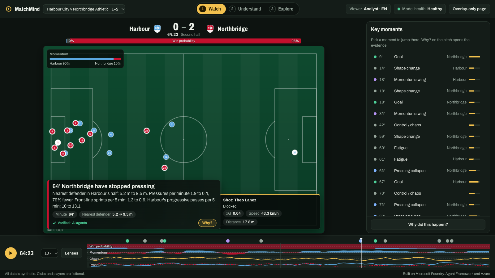
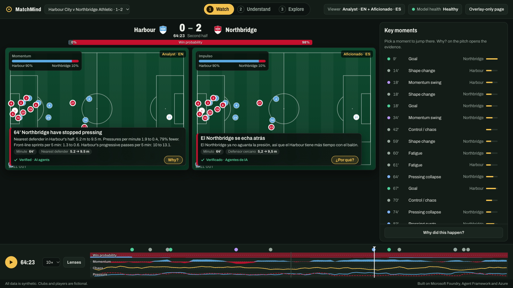
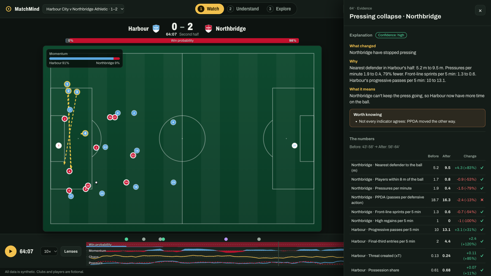
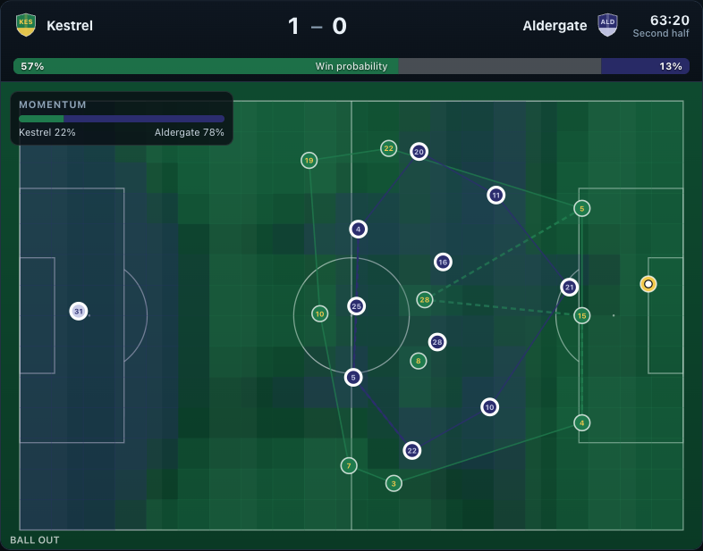
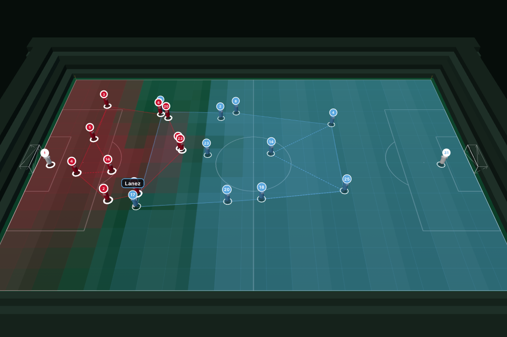
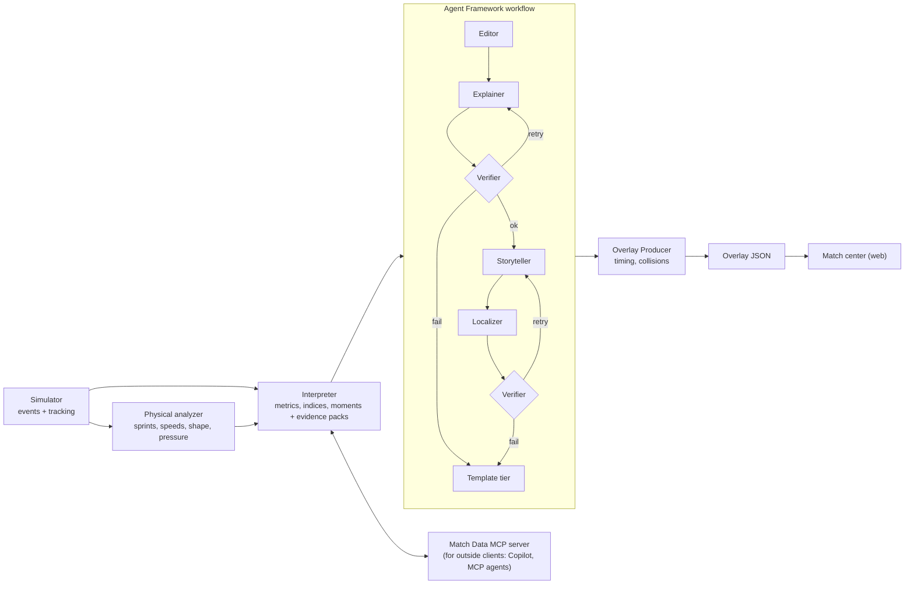
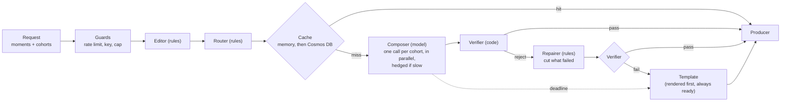

# MatchMind

**Explained, personalized football match intelligence from synthetic events.**
Built for the Microsoft × Premier League *Inside the Game* developer hackathon.



Football stories do not end at the scoreline. MatchMind ingests a stream of synthetic match events and
tracking, works out *what changed and why it matters*, and delivers it as timed on-screen graphics and
recaps that read differently for an analyst and a casual fan, in English, Spanish or Turkish. Every
number in every sentence is traced to computed evidence and checked by code before it reaches the screen.

All data is synthetic. The league, clubs, crests and players are fictional.

**Try it:** the match center runs on Azure Static Web Apps (<https://happy-beach-0379fb50f.5.azurestaticapps.net>) and as a
GitHub Pages mirror (<http://kaanoguzkan.com/insidethegamehackathon/>). Both play three pre-generated matches from static files, and
both have a **Live AI** switch that asks the Azure-hosted Brain to write the story for the selected moment *now*, for your viewer
settings, in under five seconds. The Brain's API is documented in [docs/brain-api.md](docs/brain-api.md).

## How to use the match center

The pitch always fits the screen. Depth comes from three steps in the top bar (keys `1`, `2`, `3`), so nobody has to scroll to find things:

| Step | Question it answers | What you see |
|---|---|---|
| **1 Watch** | What is happening? | The pitch with verified lower-thirds, the score and live win probability, the key-moment list. |
| **2 Understand** | Why did it happen? | The recap in your language and tone, the tactics of both teams, the moments; **Why?** on any graphic opens the evidence drawer (explanation, caveats, before/after numbers, agent trace). |
| **3 Explore** | What do the numbers say? | Eleven analytics views grouped by question (the match, shape and space, players, phases of play, context). Views that have a pitch drawing offer **Show on pitch**. |

The match strip at the bottom never goes away: play, speed, **View** (2D or 3D, camera angle, follow the ball), **Lenses** (pitch control, team shape, offside line, passing options, runs) and a draggable ribbon of win probability, momentum, chaos and pressure with the key moments marked. Viewer settings (analyst or casual, language, club, followed player, accessibility, two viewers side by side) and the model-health switch live in menus in the top bar. The whole view is in the URL, so any state can be shared.

**Ask the match.** In the Understand step, the **Ask** tab takes a question ("who controlled the match?", "how did the pressing change?") and answers it from the match data: a planner picks match-data tools, code runs them, an answerer writes the reply from their results only, and the Verifier checks every number and name. Each answer shows which tools it looked at, how long it took and what it cost; an off-topic question is politely refused. It works in English, Spanish and Turkish and needs the Brain, like Live AI.

**Live AI.** Switch it on (top bar, or inside the evidence drawer) and select a moment: the page asks the Brain to write that
moment's story for each viewer on screen, and swaps the model's text in for the recorded one. The drawer shows who wrote it
(`E R C ✓`: editor, router, composer, verifier), how long it took, and whether it came from the cache. If the Brain is asleep
the page says so and waits (a Container App that scaled to zero needs about 20 seconds); if it is down or slow, the recorded
text stays. Nothing in the replay depends on it.

## The pipeline

| Stage | What happens | Where |
|---|---|---|
| **Ingest** | A 5 Hz simulator plays matches of a fictional league (nine formations that change shape with the ball, choreographed set pieces) and emits an event feed plus player and ball tracking | `src/matchmind/sim/` |
| **Interpret** | Code derives sprints, speeds, pass difficulty, xG, xT, momentum, a control-vs-chaos index and pressing measures, and detects the moments worth telling | `tracking/`, `intel/` |
| **Explain** | A team of Microsoft Agent Framework agents explains *why* each moment matters, citing an evidence pack; a Verifier checks every claim. Two paths: the five-agent workflow (offline, for the replay packages) and a **fast path** that answers live inside five seconds | `agents/` |
| **Render** | Timed, machine-readable overlay JSON, drawn over a live 2D match view (or any renderer) | `core/contracts.py`, `web/` |
| **Personalize** | The same intelligence becomes different text per viewer: analyst or casual, club-side tone, followed player, language | `agents/templates.py`, `web/` |

<p>


</p>

## Modern football, not one stretched shape

Clubs play recognisable European archetypes: a 4-3-3 with inverted fullbacks and a false nine, a gegenpressing
4-2-3-1 with overlapping fullbacks, a direct 4-4-2 with long throws, a 3-4-3 with wing-backs that becomes
a 5-4-1 without the ball, a 5-3-2 low block. Corners come as near-post, far-post, short and edge-of-box
routines against zonal or man-marking defences; free kicks get walls; goal kicks are built short or sent long
against a pressing line; and scripted stories include in-match formation changes. All of it is in the tracking
and the events, and visible in the **Tactics** tab (Understand step). See [docs/tactics.md](docs/tactics.md).

## Opta-style analytics

Win probability with the swing of every goal, possession value (VAEP / OBV style), post-shot xG, pitch control,
packing and line-breaking passes, passing networks, formations recognised from tracking, off-ball runs, physical
load, transitions, set-piece review, season context with live milestones, a pre-match prediction and player radars
with "plays like" matches: the metrics Opta, StatsBomb, SkillCorner and Second Spectrum publish, from the
synthetic feed, in the **Explore** workspace (eleven views in five groups) and as live pitch graphics (pitch control, team shape,
offside line, passing options, run trails).



The pitch can also be watched in **3D**: a WebGL scene with the same live graphics drawn on the grass, three cameras
(broadcast, behind the goal, from above), drag to turn and scroll to zoom, and a camera that follows the ball. It loads
only when used, and falls back to the flat pitch when a browser has no WebGL. Players that the data puts almost on
top of each other are drawn a little apart (display only, never more than a few metres, the ball carrier stays put),
so two figures never overlap.



Definitions, fitted-model diagnostics and honest limits: [docs/analytics.md](docs/analytics.md). Every replay also has a
17-page **PDF report** that explains the match, the tactics in each phase, every position and every view
([docs/report.md](docs/report.md)); the match center links to it.

## Why you can trust what it says

1. **Code computes, models explain.** Numbers come from deterministic code. A language model may only
   choose, explain and phrase.
2. **Evidence or it did not happen.** Each moment carries an evidence pack: metrics with before, after,
   delta and percentage change precomputed, and a `consistent` flag saying whether each metric supports or
   contradicts the story. Agents may use only the pack.
3. **A Verifier that code controls** checks every number, player, club, citation, language and policy
   rule, including written-out counts ("three shots") and cherry-picked metrics. A model cannot mark its
   own homework.
4. **Degrade, never drop.** If the model is slow, wrong or down, the beat retries with feedback, then falls
   back to verified, localized templates. Overlays always land on time. Use the **Model health** menu in
   the app to watch it happen.

## Run it

```bash
uv sync
uv run matchmind build-replay pressing-collapse     # simulate, analyze, interpret, run the agents, write a package
uv run matchmind evals                              # quality gates over the committed packages
uv run matchmind build-pdf                          # the printable match report for every replay (docs/report.md)
uv run matchmind fit-models                         # win probability, possession value, post-shot xG
uv run matchmind build-season                       # the league's simulated history
uv run pytest -m "not slow"                         # the fast suite
cd web && pnpm install && pnpm dev                  # the match center (67 tests: pnpm test)
```

No keys, network or GPU needed: the default model client answers from the template engine so the real
Agent Framework workflow runs offline. Point it at a real model with `MATCHMIND_LLM=openai` (GitHub
Models, Ollama, Azure OpenAI) or `MATCHMIND_LLM=foundry` (Microsoft Foundry); see
[docs/agents.md](docs/agents.md).

```bash
uv run uvicorn apps.brain.main:app --port 8000      # REST API + MCP server
docker build -t matchmind-brain . && docker run -p 8000:8000 matchmind-brain
VITE_BRAIN_URL=http://localhost:8000 pnpm --dir web dev   # the match center with the Live AI switch pointed at it
```

With a Microsoft Foundry project (see [docs/foundry.md](docs/foundry.md) and [docs/running-on-azure.md](docs/running-on-azure.md)):

```bash
export FOUNDRY_PROJECT_ENDPOINT=https://<account>.services.ai.azure.com/api/projects/<project> MATCHMIND_LLM_MODEL=<deployment>
uv run matchmind foundry-register     # the eight agents as versioned Foundry prompt agents
uv run matchmind foundry-evals        # Foundry's groundedness, relevance, coherence and fluency evaluators over the overlay text
uv run matchmind foundry-host         # the fast path as a Foundry hosted agent
MATCHMIND_LLM=foundry MATCHMIND_AGENTS=foundry uv run uvicorn apps.brain.main:app   # the Brain calls the registered agents
azd up                                # Container Apps, Static Web Apps, Cosmos DB, Application Insights ... (free tier)
```

Every setting is listed in [docs/configuration.md](docs/configuration.md).

### Ask the match from GitHub Copilot

The Match Data MCP server exposes 25 tools (match state, window stats, event chains, win probability, key actions by possession value,
space control, passing networks, measured formations, line breaks, off-ball runs, physical load, transitions, set pieces, shot maps,
goalkeepers, player profiles, season context and predictions ...). `.vscode/mcp.json` points Copilot's agent mode at a local
Brain, so you can ask *"who controlled the last 15 minutes of pressing-collapse?"*.

## Architecture



The live path (the Brain, `POST /api/beats`, five seconds) puts rule-based agents around a single model call per viewer cohort:



Details: [docs/architecture.md](docs/architecture.md), the agents in [docs/agents.md](docs/agents.md).

## Microsoft technologies, and how far each is verified

| Technology | Use | Status |
|---|---|---|
| **Microsoft Agent Framework 1.20** | Editor, Explainer, Storyteller, Localizer, Composer and Recap Writer as `Agent`s; a `WorkflowBuilder` graph with retry loops and fallbacks; rule-based Router, Cache and Repairer agents around the live path | Used and tested: offline with a fault injector that exercises every recovery path, and live against `gpt-4.1-mini` on Foundry |
| **Model Context Protocol** | Match Data MCP server, 25 tools, served over streamable HTTP | Used and tested, including a real MCP client over HTTP |
| **Microsoft Foundry** | The model (`gpt-4.1-mini`), eight agents registered as versioned prompt agents that the Brain calls, a hosted agent (`matchmind-newsroom`), Foundry evaluations, and traces in Application Insights | **Run against a live project** (Oct 2026); the SDK parts are experimental. Results and caveats: [docs/foundry.md](docs/foundry.md) |
| **GitHub Copilot** | Built with it; `.github/copilot-instructions.md` and the MCP config for agent mode | In use |
| **Azure Container Apps, Static Web Apps, Cosmos DB, Application Insights, Log Analytics, Container Registry** | `infra/` Bicep on the free tier: the Brain, the web app, a shared cache in Cosmos DB (identity only, no keys), traces, a budget with alerts, a daily log cap | **Deployed and verified** (Oct 2026): scale-to-zero cold start, rate limits, the shared cache across a restart, traces. See [docs/running-on-azure.md](docs/running-on-azure.md) |
| **SignalR, Storage, Key Vault** | Provisioned by the same Bicep | Provisioned only; the app does not use them yet (below) |
| **GitHub Actions** | CI (lint, tests in parallel, quality gates, schema sync, web build, Bicep compile, container smoke test), Pages mirror, OIDC deploy | CI passes on GitHub. Two runs failed, both on a Docker Hub rate limit (HTTP 429) while pulling the base image; since the Dockerfile builds from `ghcr.io`, the last four runs pass. Pages is live |

What is **not** built: the event-driven pipeline of the plan (Azure Functions on a Cosmos change feed, Event Grid, SignalR
publishing to the browser) and Microsoft Fabric. The replay path (static files, no backend) is what the demo and the judge link
use; the Brain runs the same agents on demand for Live AI. See [docs/running-on-azure.md](docs/running-on-azure.md) and the
plan's status section.

## Measured results

* **Realistic synthetic data.** 100 simulated matches, all 19 league averages inside target bands (goals
  2.6, shots 26, passes 1,103, pass completion 79%, distance 11.9 km, top speed 34.8 km/h ...).
  `uv run matchmind report-realism`; a test enforces it. See [docs/data-card.md](docs/data-card.md).
* **Detects a hidden story.** The pressing collapse scripted at 55:00 is found in **15 of 16** seeds, a
  median 9 minutes later, and never fires as a false collapse in 16 unscripted controls. Pressing is read
  from tracking (PPDA over five minutes rests on 0-3 actions and is too noisy); see
  [docs/metrics.md](docs/metrics.md).
* **Quality gates.** Over the three replay packages (384 narrative overlays): numeric fidelity 1.0, 100% of narrative text
  verified, 24/24 recaps verified per match, contradicting evidence always admitted, analyst text 3 to 5 times as
  number-dense as casual text. `uv run matchmind evals` (CI-gated).
* **Graceful degradation.** The same three matches three ways: healthy (336 agent-written overlays, 48 template), unreliable model
  (16 first time, 150 recovered by retry, 218 template), outage (all 384 template, none lost).
* **Live, in five seconds.** On the deployed Brain with `gpt-4.1-mini` (45 uncached model calls, 15 requests of three cohorts each):
  request time median 2.6 s, 95th percentile 4.2 s, no missed deadline; 43 overlays written by the model, 1 mended by the
  Repairer, 1 fell back to a template. A repeated request is served from cache in 2 ms, and from Cosmos DB after a restart in
  about 280 ms. Method and caveats: [docs/agents.md](docs/agents.md).
* **Foundry evaluations.** 30 overlays per group judged by Foundry's built-in evaluators: groundedness, relevance and coherence 30/30
  for agent-written text (fluency 26/30); the template control scores the same on the first three (fluency 24/30). See
  [docs/foundry.md](docs/foundry.md) for what this does and does not show.

## Repository

```
src/matchmind/   core/ sim/ tracking/ intel/ analytics/ agents/ mcp_server/ report/   runner.py evals.py cli.py
                 guards.py telemetry.py foundry_agents.py foundry_evals.py foundry_host.py
apps/brain/      FastAPI service: REST + MCP + both agent paths, with rate limits and an admin key
foundry/hosted/  the entry point of the Foundry hosted agent
web/             React + TypeScript match center (replay player, overlays, evidence drawer, recaps, Live AI)
data/            league, scenarios (3 stories), replay packages (3 matches, ~10 MB)
infra/           Bicep + azure.yaml          schemas/   JSON Schemas of the public contracts
docs/            architecture, agents, brain-api, configuration, foundry, running-on-azure, tactics, analytics, metrics,
                 overlay contract, data card, responsible AI, report
tests/ evals/    Python tests (3 slow) + 67 web tests      SOLUTION PLAN.md   design, schedule, status
```

## Honest limits

* **Real-model quality is measured on a small scale.** The live numbers above come from one model (`gpt-4.1-mini`), 45 calls and one
  afternoon; latency of a shared model endpoint varies by a second or more, which is why the live path has a hard deadline, template
  fallbacks and a hedged second call. The Foundry evaluation scores recorded text and uses a judge from the same model family.
* **The first request after idle is slow.** The Brain scales to zero (free tier), so a cold start takes about 20 seconds; the page wakes it on load
  and shows "Waking the AI service" meanwhile.
* **No event-driven pipeline.** Live mode, Functions, Event Grid and SignalR publishing are not built; SignalR, Storage and Key Vault are provisioned
  and unused. The shared cache in Cosmos DB is the one place the app uses Cosmos.
* **Experimental SDK parts.** Registered Foundry agents, the hosted agent and Foundry evaluations use experimental Agent Framework APIs that may change.
  The hosted agent's first call to a new session can time out while its container starts.
* The demo video is not recorded.
* Other detectors (chaos flip, momentum swing) are noisier than the pressing detector.
* Pitch control uses positions only, not velocities or the ball, and win probability, possession value and xG are fitted on simulated, not real,
  matches ([docs/analytics.md](docs/analytics.md)).

## License

MIT, see [LICENSE.md](LICENSE.md). Code of conduct: [CODE OF CONDUCT.md](CODE%20OF%20CONDUCT.md).
