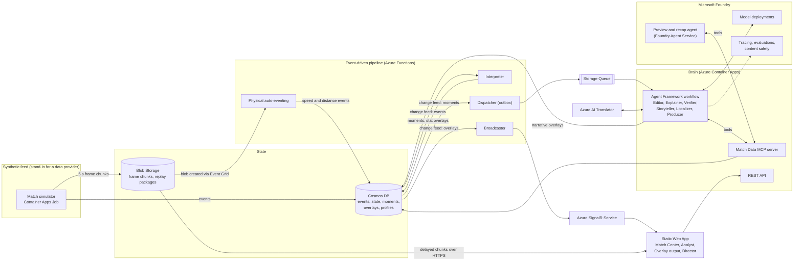
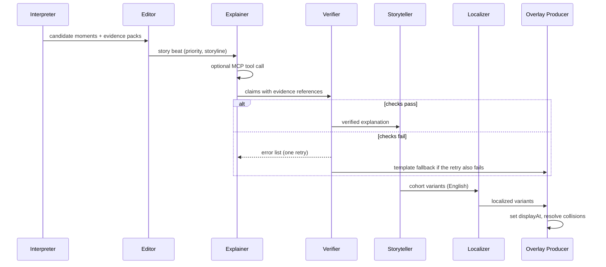
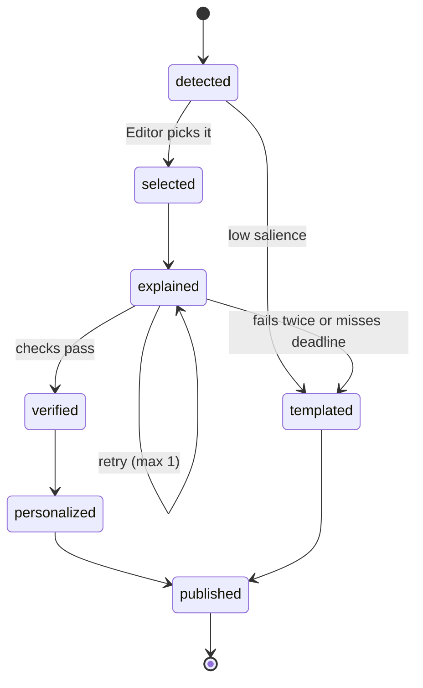

# MatchMind: Solution Plan

*Working name. Entry plan for the Microsoft × Premier League "Inside the Game" Developer Hackathon. Written Sunday 4 October 2026; status section updated the same night.*

> **How to read this**
> - **Status:** what is built, measured and still open (start here).
> - Sections 0–4: assumptions, dates, product and architecture.
> - Sections 5–10: the five pipeline stages the rules ask for (ingest, interpret, explain, render, personalize).
> - Sections 11–15: data, cost, latency, enterprise readiness and the Microsoft stack.
> - Sections 16–23: scoring, repo layout, schedule, scope, demo video, checklist, risks and open questions.
>
> Numbers marked **\*** come from general knowledge of Azure and GitHub pricing and were not checked today. Verify them on the official pricing pages before relying on them.

---

## Status: where the build stands

*Updated Monday 5 October 2026 (UTC+3), the day before the Submission Period opens. Everything below is committed locally; nothing is pushed or deployed.*

**In one paragraph.** All five pipeline stages run end to end on a laptop with no keys, network or GPU: the simulator produces matches and tracking, the interpreter finds moments and builds evidence packs, a Microsoft Agent Framework workflow explains them (checked by a code Verifier, with a degradation ladder), the Overlay Producer emits schema-validated overlay JSON and recaps in three languages for eight audiences, and a React match center plays it with a personalization panel, evidence drawer and a model-health switch. An MCP server and a FastAPI Brain expose the same data and agents, a container image and Bicep infrastructure exist, and CI gates quality. On top of that sit an Opta-style analytics layer (win probability, possession value, post-shot xG, pitch control, packing, off-ball runs, physical load, formations from tracking, a simulated season with predictions and milestones) and broadcast-style pitch graphics. What is **not** done is everything that needs a real Azure subscription or a real language model, and the demo video.

### Build status

| Part | Status | Notes |
|---|---|---|
| Fictional league, simulator, tracking feed, scenarios | Done | 19 realism bands enforced by a test; 3 scripted stories (seeds 15, 35, 25) |
| Formations, phase shapes, tactic tags, set pieces | Done | 9 formations with attacking and defensive shapes, club tags, corner/free-kick/goal-kick/throw-in routines, in-match formation changes (`docs/tactics.md`); recalibrated, detectors re-derived |
| Physical analyzer, interpreter, evidence packs | Done | Pressing detected from tracking; streaming equals batch |
| Template engine EN/ES/TR | Done | Every moment type and fact card, analyst and casual |
| Verifier | Done | Deterministic, adversarially tested, wired into the workflow and the Producer (the `verified` flag is earned, not asserted) |
| Agent Framework workflow, offline model, fault injector | Done | Editor, Explainer, Storyteller, Localizer, Recap Writer; levels 0 agent, 1 retry, 2 template, 3 stat graphic |
| Overlay Producer, JSON Schemas, replay packages | Done | Version 2 packages; 3 matches, about 10 MB; recaps 3 kinds x 8 cohorts; healthy, unreliable and outage variants |
| Web app | Done | Fit-to-screen pitch, a three-step path (Watch, Understand, Explore), overlays, viewer and model-health menus, match strip with story ribbon, evidence drawer, recaps, Tactics tab, Explore workspace (11 views in 5 groups), win-probability line, pitch lenses, EN/ES/TR UI, accessibility options |
| MCP server (25 tools) and Brain API | Done | Verified over real HTTP, in tests and in Docker; registry hardened; fault-switch routes now opt-in and key-protected |
| Evals and CI gates | Done | `matchmind evals`; reproducibility check is informational |
| Dockerfile, Bicep, `azd`, GitHub Actions | Written | Image builds and runs; Bicep compiles; workflows `actionlint`-clean with a test that parses them and checks the SHA pins, third-party actions pinned to commit SHAs; **never deployed to Azure, and CI has not yet passed on GitHub** (its first runs failed on an invalid step name, now fixed) |
| README and docs/ | Done | Honest "verified vs not" tables |
| Opta-style analytics | Done | Win probability, possession value (VAEP style), xGOT, pitch control, packing and line breaks, networks, measured formations, runs, load, transitions, set-piece review; models fitted from simulated matches (`docs/analytics.md`) |
| Season history, milestones, prediction, radars | Done | 42 simulated matches; table, form, head-to-head, records, Poisson prediction, goal milestones, player radars and "plays like" |
| Pitch graphics | Done | `pitch_graphic` overlays with geometry; live pitch control, team shape, offside line, passing options and run layers in the match center |
| Azure adapters (Functions, Cosmos change feed, Event Grid, SignalR publishing) | Not built | The Brain runs the agents on demand; replays are static |
| Foundry hosted recap agent, evals, tracing; real-model run | Not built / unverified | `FoundryChatClient` and the OpenAI-compatible client are wired but unrun |
| Live streaming mode | Not built | Replay and on-demand only |
| Demo video | Not recorded | |

528 tests are collected (the fast and slow suites and ruff pass at the last run) plus 39 web tests. About 12,600 lines of Python in the package and 4,600 of web code.

### Measured results

* **Realism.** All 19 league averages inside their bands over 100 matches (table in `docs/data-card.md`), after re-calibrating for phase shapes and set pieces.
* **Pressing-collapse detection.** Found in 15 of 16 seeds, median 9 minutes after the change at 55:00; no false collapse in 16 controls (study in `docs/metrics.md`). The other detectors are noisier and carry lower salience.
* **Quality gates over the three replay packages.** Numeric fidelity 1.0, verification 1.0, language 1.0, honesty about contradicting metrics 1.0, recaps 24 of 24 verified, analyst text about 4x as number-dense as casual.
* **Resilience demo.** Healthy: 144 agent-written overlays. Unreliable model: 64 recovered by retry, 112 template. Outage: all 176 template, none lost.
* **Tactical shifts.** Defensive shape is compared like with like (opponent in possession, ball in the middle zone); thresholds re-derived at 7 m line / 10 m width: about 0.7 false alarms a match, the scripted shift found in 17 of 20 seeds.

### Where the build differs from this plan

1. Pressing is detected from tracking (nearest-defender distance, corroborated and persistent), not from PPDA, which is too noisy over five minutes.
2. Evidence packs flag metrics that move against the story (`consistent`), and the Verifier requires the text to admit them.
3. Pass difficulty and shot context are measured from tracking and arrive as late "physics" enrichments, as they would from a provider.
4. The tracking feed carries a ball-in-play flag; the simulator was changed to make the style dials measurable.
5. Detector thresholds come from data (tactical shifts need 14 m line or 10 m width held twice).
6. Tooling: Python 3.12 with `uv`, Agent Framework 1.20 (`agent-framework-core` plus extras instead of the 30-package meta-package), MCP SDK 1.30, pnpm 11 with `allowBuilds`.
7. Security review fixes: replay ids validated in the web app, the Producer's `verified` flag is earned, the match registry is slug-validated, limited to listed ids and LRU-bounded, the director fault routes are off unless `MATCHMIND_DIRECTOR=1`, and workflow actions are pinned.

### Not yet verified

- **Anything that needs a real language model.** No model or key was available; prompts, structured-output behaviour, quality, latency and cost are unmeasured.
- **Any Azure deployment.** No `az` or `azd` login here; the first `azd up` is yours to run (`docs/running-on-azure.md`).
- **Free-tier limits and prices marked with \* elsewhere in this plan.**
- **GitHub Actions on GitHub**, and cross-machine floating-point reproducibility of the replay packages.

### Next

1. Push to a public GitHub repository; confirm CI and the Pages mirror run (needs your account).
2. On or after 13 October (free-account credit window), create a Foundry project, run `azd up`, then measure real-model quality and latency and tune prompts.
3. Record the under-2-minute demo video from the running app.
4. If time allows: season history and milestones, the Functions adapters, live mode.

---

## 0. Assumptions and key dates

| Assumption | Value |
|---|---|
| Team | Solo (you answered "1"). The workstreams in §17–18 split cleanly if teammates join (max 4). |
| Background | Comfortable with AWS, new to Azure. §4.3 maps the services. |
| Platform | 100% Microsoft: Azure, Microsoft Foundry, GitHub. |
| Budget | Near $0: free tiers, free credit, a small token spend. No dedicated GPU. |
| Models | Small and open-weight first where quality is good enough. The final choice is made by evals, not by guessing. |

| Milestone | Official time (PT) | Your time (UTC+3) |
|---|---|---|
| Submissions open | Tue 6 Oct, 09:00 | Tue 6 Oct, 19:00 |
| Registration closes | Tue 20 Oct, 12:00 | Tue 20 Oct, 22:00 |
| **Submission deadline** | Tue 27 Oct, 23:59 | **Wed 28 Oct, 09:59** |
| Judging ends (the demo must stay up until then) | Tue 10 Nov, 23:59 | Wed 11 Nov, 10:59 |
| Winners announced | by Fri 20 Nov | n/a |

You can start building now. Rule 4.3 only requires the project to be created after registration opened (29 September).

---

## 1. Summary

MatchMind turns a live stream of synthetic football events into **explained, personalized match intelligence**:

1. **Ingest.** A code-based simulator plays realistic matches of a fictional league. It emits events plus 5 Hz player tracking, the way a data provider would.
2. **Interpret.** Deterministic code computes stats and indices: pass difficulty, ball and shot speed, sprints, momentum, pressure, control vs chaos and rhythm. It flags candidate moments, each with an **evidence pack**.
3. **Explain.** A team of agents on **Microsoft Agent Framework** handles each moment. They pick the story and explain *why* it matters, citing evidence. They check every number, then rewrite the story per audience and per language.
4. **Render.** The output is timed, machine-readable **overlay JSON**, drawn over a live 2D match view. A separate overlay-only page can be captured by broadcast tools.
5. **Personalize.** Viewers choose a mode (analyst, casual fan, club fan, player-focus, audio-described) and a language. The facts stay the same; the story changes.

**Stack:** Microsoft Foundry, Agent Framework, MCP, Azure Container Apps, Functions, Cosmos DB, SignalR and Static Web Apps. Built with GitHub Copilot and deployed with `azd`.

**Category targets:** Best Multi-Agent System is the main target. Best Use of Microsoft Foundry is the secondary one.

---

## 2. What the rules force

| Rule | What it says | Design consequence |
|---|---|---|
| 4.1 (i) | One pipeline with five stages: ingest, interpret, explain, render, personalize | Every stage has a named component (§5–9). The rules call a stats-only or personalization-only build incomplete. |
| 4.1 (ii) | Player tags with speed and distance thresholds; pass distance, accuracy and difficulty; ball and shot speed; auto-eventing | All of these are computed (§6). Speed and distance events are **derived from the tracking feed** ("physical auto-eventing"). Video auto-eventing is out of scope because no footage is provided (4.7). |
| 4.1 (iii) | Narratives, player context, milestones, recaps | Storyteller and Recap agents, plus a synthetic season history so milestones have context. |
| 4.1 (iv) | Explain why: control vs chaos, pressure changes, rhythm | Three named indices (§6.2), each backed by an evidence pack. |
| 4.1 (v) | Create or extend synthetic datasets | The simulator, a realism report and a published dataset are first-class deliverables. |
| 4.1 (vi) | Multi-language output | A Localizer agent plus AI Translator, with a football glossary per language. |
| 4.3 | New projects only; authorized third-party use | A fresh public repo and a license list for all dependencies. |
| 4.4 | Video under 2 minutes at a public URL; no third-party trademarks or copyrighted music; public repo; a pitch naming the Microsoft tech | A fictional league with our own crests; no music, or only music you have rights to. Script in §20. |
| 4.7 | Synthetic, football-realistic data; no footage provided | Our own simulator, with fictional clubs and players. |
| 4.8 | Free working access for judges until judging ends | Replay mode with zero live cost, a rate-limited live mode and a fallback mirror (§12.5). |
| 4.9 | Materials in English | English is the UI default; the video has English captions. |
| 5 | Limited changes after the deadline | Tag the submitted commit and freeze features. |
| 6 | Stage 1 is pass/fail on theme and required tech. Stage 2 is five criteria at 20% each. Judges may score from the video and text alone. | The Microsoft stack is visible everywhere. The video carries the most weight (§20). |

---

## 3. The product

### 3.1 One match, many experiences

| Viewer | What MatchMind gives them |
|---|---|
| Analyst | Dense stat cards, live indices, timelines (xG race, momentum, pressure) and an evidence drawer on every claim |
| Casual fan | A few plain-language story beats, no jargon and a simple momentum bar |
| Club fan | The same facts told from their club's side. The tone changes; the facts never do. |
| Player-focus fan | One player followed all match: name tag always on, personal stat cards, every involvement highlighted |
| Any language | Demo set: English, Spanish, Turkish. Stretch: Arabic (right-to-left). |
| Accessibility | Audio-described mode (narration for screen readers), reduced motion, high contrast and colour-blind-safe team colours |
| Producer or broadcaster | An overlay-only output page, overlay JSON and an optional approval step before anything goes on air |

### 3.2 Main screens

- **Match Center:** 2D live pitch, scoreboard, overlays, profile switcher and a "Two viewers, one match" split screen.
- **Analyst view:** timelines, indices and the evidence drawer. Stretch: an "Ask the match" Q&A.
- **Recap page:** pre-match preview, half-time and full-time recaps per profile and language.
- **Overlay output:** a transparent page with overlays only, for broadcast tools that capture a browser source.
- **Director console:** start a match (seed, scenario, start minute, speed), inject events (red card, tactical change) and simulate failures.

---

## 4. Architecture

### 4.1 Overview



### 4.2 Components

| # | Component | Azure service | Job |
|---|---|---|---|
| 1 | Simulator | Container Apps Job | Plays a match in real time. Writes events to Cosmos DB and 5-second tracking chunks to Blob Storage. |
| 2 | Physical analyzer | Functions (Event Grid trigger) | Derives sprints, top speed, distance, ball speed and shot speed from the tracking chunks. |
| 3 | Interpreter | Functions (Cosmos DB change-feed trigger) | Updates rolling stats and indices, detects candidate moments and emits template stat overlays. |
| 4 | Dispatcher | Functions (Cosmos DB change-feed trigger) | Outbox pattern: once a moment is safely stored, puts it on the work queue. |
| 5 | Brain | Container Apps (queue-driven scaling with KEDA, scales to zero) | Runs the Agent Framework workflow, the Match Data MCP server and the REST API. |
| 6 | Broadcaster | Functions (change-feed trigger + SignalR output) | Pushes each new overlay to the right viewer groups. |
| 7 | Web | Static Web Apps | Match Center, Analyst view, Recap, Overlay output, Director console. |
| 8 | State store | Cosmos DB for NoSQL | Events, rolling state, moments (the agents' shared state), overlays, profiles, season stats. |
| 9 | Files | Blob Storage | Tracking chunks and pre-generated replay packages. |
| 10 | Real-time push | Azure SignalR Service | Sends overlays to browsers. |
| 11 | AI platform | Microsoft Foundry | Model deployments, hosted preview and recap agent, tracing, evaluations, content safety. |
| 12 | Translation | Azure AI Translator | A tool for the Localizer agent. |
| 13 | Operations | Application Insights, Key Vault, managed identities | Telemetry, secrets and keyless authentication. |

### 4.3 If you think in AWS

| AWS | Azure in this design |
|---|---|
| Bedrock (models) | Microsoft Foundry model deployments |
| Bedrock Agents | Agent Framework (in code) + Foundry Agent Service (hosted) |
| Lambda | Azure Functions |
| ECS Fargate / App Runner | Azure Container Apps (+ Container Apps Jobs) |
| DynamoDB + Streams | Cosmos DB + change feed |
| SQS | Azure Storage Queues |
| S3 + S3 event notifications | Blob Storage + Event Grid |
| API Gateway WebSockets / AppSync subscriptions | Azure SignalR Service |
| Amplify Hosting / S3 + CloudFront | Azure Static Web Apps |
| CloudWatch / X-Ray | Azure Monitor / Application Insights (OpenTelemetry) |
| IAM roles | Managed identities + Entra ID role assignments |
| Secrets Manager | Key Vault |
| CloudFormation / CDK / SAM | Bicep + Azure Developer CLI (`azd`) |
| Amazon Translate | Azure AI Translator |
| Bedrock Guardrails | Foundry content filters / Azure AI Content Safety |
| AWS Budgets | Azure Cost Management budgets |

### 4.4 Two topologies, one codebase

Every external dependency sits behind a small interface (ports and adapters):

- `EventSink`
- `FrameStore`
- `MomentQueue`
- `OverlayPublisher`
- `ModelClient`

There are two adapter sets:

- **Local:** in-memory bus, local files, local model (Foundry Local or Ollama). One command runs everything on your laptop for $0: `matchmind run-local --scenario pressing-collapse`.
- **Azure:** Cosmos DB, Blob Storage, Storage Queue, SignalR and Foundry, wired as in §4.1.

Build and test the whole pipeline locally first (6–14 October). After that, moving to Azure means swapping adapters. This is the main risk reducer for a solo build.

### 4.5 Key decisions

1. **Code computes, the LLM explains.** Numbers come from deterministic code, so they are exact, cheap and testable. Models only do judgment and language.
2. **Evidence or it didn't happen.** Agents may only use facts from the evidence pack. A verifier checks every number and name before anything goes on screen.
3. **Degrade, never drop.** If the full narrative can't be produced, the system falls back to a retry, then a template, then a stat card. The overlay still lands on time (§7.6).
4. **Broadcast delay as look-ahead.** Viewers watch 15 seconds behind the simulator, like a real broadcast delay. The system sees each moment early and has the text ready when the viewer gets there.
5. **Chunked tracking feed, not frames over SignalR.** Tracking is served as 5-second files, the way low-latency video streaming works. SignalR only carries overlays, which keeps it inside the free tier.
6. **Change feed as the outbox.** Work is dispatched only after state is durably stored. Retries are safe because every ID is deterministic.
7. **Personalize per cohort, not per viewer.** Viewers with the same settings share one generated output, so cost grows with the number of distinct profiles, not with the audience size.
8. **The simulator is a stand-in for a real provider.** A real event or tracking feed can replace it through the ingest adapter. Nothing downstream changes, which matters for the real-world impact score.
9. **No dedicated GPU.** It is too expensive, quota is unlikely on a new account, and it can't stay up free for judges. Latency is handled by decisions 4 and 5 and by small models.
10. **Replay packages for judges.** Curated matches are pre-generated and served as static files, so the judge experience has no live cost and no single point of failure.

---

## 5. Stage 1, Ingest: the synthetic match engine

### 5.1 League bible

- **League:** a fictional league ("Lumen League") with six clubs: Harbour City (HAR), Northbridge Athletic (NOR), Redmoor United (RED), Kestrel Vale (KES), Aldergate Rovers (ALD) and Saltmarsh Town (SAL).
- **Squads:** 25 generated players per club. Names come from a syllable generator and are checked against a denylist of real players and clubs.
- **Crests:** simple generated SVG monograms. They are our own work, so there is no IP risk.
- **Club style profiles:** each club has settings for pressing height and intensity, build-up (short or direct), width, tempo, defensive line height, counter-attack bias and formation.

### 5.2 Match model

- **Time step:** 0.2 seconds (5 Hz). Each tick updates the ball, the 22 players and the possession state.
- **Possession phases:** build-up → progression → final third → shot or turnover. Turnovers can turn into counter-attacks.
- **Decisions:** the ball carrier chooses between pass, carry, dribble, shot and clearance. Each option is scored on threat gained versus risk, with noise based on player skill.
- **Outcome models:**
  - Pass success uses a logistic model of distance, pressure, angle, pass type and passer skill.
  - Shot quality (xG) uses a logistic model of distance, angle, body part, assist type and pressure. Goals are sampled using finisher and goalkeeper skill.
  - Ball and shot speed are sampled by type and distance. Driven passes are faster than lofted ones.
- **Movement:**
  - Players follow formation anchors that shift with the ball and the phase of play.
  - Role offsets and noise vary the positions.
  - Maximum speed and acceleration come from each player's pace attribute.
- **Stamina:** drains with sprinting and pressing. It lowers speed and pressing intensity late in the match. Substitutions happen around 60–80 minutes.
- **Also modelled, in simplified form:** set pieces, fouls, cards and offsides.
- **Seeded randomness:** the same seed always produces the same match.

### 5.3 Scenarios

Scenarios are scripted changes that make the demo reliable. You know a pressing collapse will happen around 55 minutes, and the pipeline has to detect and explain it without being told.

```yaml
id: pressing-collapse
seed: 42
home: HAR
away: NOR
script:
  - at: "55:00"
    team: NOR
    change: { press_intensity: -0.35 }   # tired front line stops pressing
  - at: "70:00"
    team: HAR
    event: substitution                   # fresh winger
  - at: "78:30"
    team: NOR
    change: { line_height: +8 }           # desperate high line, invites counters
```

The Director console can also inject events live during a match, such as a red card or a tactical switch.

### 5.4 Output

- **Events** go to Cosmos DB `events`, one document per event. The document ID is the event ID, so a retried write cannot create a duplicate.
- **Tracking** goes to Blob Storage as 5-second chunks of gzip JSON.
- **Event types:**
  - Ball and play: kickoff, pass, carry, dribble, shot, save, block, clearance, interception, tackle, pressure, ball_recovery, possession_change.
  - Fouls and restarts: foul, card, free_kick, corner, throw_in, goal_kick, offside.
  - Match flow: substitution, goal, period_start, period_end.
- **Physical events** (§5.5): sprint, top_speed, distance_milestone. Ball speed and shot speed are attached to passes and shots.

Appendix A has a full example.

### 5.5 Physical auto-eventing

A separate analyzer reads the **tracking chunks**, never the simulator's internal state. From them it derives:

- player speed
- sprints (25 km/h and above)
- top-speed badges
- distance milestones
- ball speed per pass
- shot speed

In production the same analyzer would read a real tracking feed. This is a genuine form of auto-eventing without video.

### 5.6 Season history

Before the demo, simulate rounds 1–9 of the season. This is code only and takes seconds per match. It gives milestones real context, such as "his 5th goal of the season" or "first clean sheet in four matches".

### 5.7 Realism calibration

`matchmind report-realism` simulates many matches in parallel and compares 19 league averages with target bands for typical top-flight football (goals, shots, shots on target, passes, completion, possession, distance, sprints, top speed, tackles, interceptions, fouls, corners, throw-ins, goal kicks, clearances, offsides, yellow cards, pressure events). The bands are wide on purpose: they describe a plausible league, not any real one.

A test runs it on 48 matches and fails if a metric leaves its band, so a code change that makes matches unrealistic fails loudly. The measured means over 100 matches are in the status section; all 19 sit inside their bands. This is direct evidence for the judging question about "creativity and optimized synthetic data creation".

Calibration was iterative and some fixes were structural rather than numeric: attackers in the box were unmarked (so shots came from the six-yard box and conversion was too high), pressure events ignored the pressing dial, and teleporting set-piece takers produced 250 km/h "sprints".

### 5.8 Published dataset

- 50 matches of events (JSONL) in the repo, plus 3 matches with full tracking.
- Larger files go in GitHub Release assets.
- A **data card** covers the schema, how the data is generated, known limitations and the license.

---

## 6. Stage 2, Interpret

### 6.1 Metrics

| Metric | How it's computed | Shown to |
|---|---|---|
| Pass distance | Start-to-end distance in metres | Analyst |
| Pass accuracy | Completion % per player, over a rolling 15 minutes and the whole match | Analyst, player focus |
| Pass difficulty (0–10) | 10 × (1 − xPass). xPass is our completion model using distance, pressure, angle and pass type. | Everyone (key passes) |
| Ball speed | From ball positions in the tracking frames (km/h) | Everyone |
| Shot speed | Peak ball speed in the 0.4 s after a shot (km/h) | Everyone |
| Player speed and distance | From tracking: rolling speed, sprints of 25 km/h and above, total distance | Name tags and badges |
| xG | Shot-quality model (distance, angle, body part, assist type, pressure) | Analyst. Casual viewers see "big chance". |
| xT-lite | Value of moving the ball between pitch zones, on a 12×8 grid learned from the simulated season | Feeds momentum |
| Momentum | Rolling 5-minute sum of xT gained per team, and the gap between the teams | Everyone (momentum bar) |
| Field tilt | Each team's share of final-third passes | Analyst |
| PPDA | Opponent passes allowed per defensive action in the opponent's build-up zone. Lower means more pressing. Over a few minutes it rests on 0 to 3 actions, so it is shrunk toward the league mean and shown as supporting evidence, never as a trigger (§6.3). | Analyst |
| Nearest-defender distance | From tracking: distance from the ball to the nearest outfield defender, in frames where the opponent has the ball in the half this team attacks. Measured every frame, so it is stable over a few minutes. | Pressing detection |
| Fatigue proxy | Sprints and high-intensity distance per 5 minutes, compared with the player's first-half baseline | Narratives |
| Line height and width | Average defensive-line position and team width, from tracking | Tactical shift detection |
| Milestones | Counters compared against match and season history (goals, passes, distance, fastest shot) | Narratives |

### 6.2 The three explainability indices

**Control vs Chaos (0–100, per 5-minute window, whole match).**
- High chaos means many turnovers and possession changes per minute, short possessions, many duels and long contested balls.
- Low chaos means long, stable possessions.
- It is the mean of four z-scores (turnovers per minute, duels per minute, long-ball share, inverse possession length) against baselines measured over simulated five-minute windows, passed through a logistic to give 0–100.
- A companion figure says *who* is in control, using possession share and field tilt in that window.

**Pressure index (per team).**
- Built from PPDA, pressures per minute and high regains (ball won in the final third), each z-scored against the league baseline.
- A pressing *shift* is detected from tracking and corroborated by pressure events (§6.3), not from this index or from PPDA alone.

**Rhythm.**
- Tempo (passes per minute in possession), event rate and stoppage frequency.
- Detects rhythm breaks, such as a tempo change of 30% or more after a goal, card or substitution.
- Detects patterns, such as attacking waves where momentum alternates on a regular cycle.

All weights and thresholds live in one config file, documented in `docs/metrics.md`, so judges can see exactly how each number is made.

### 6.3 Moment detection

Window detectors compare the last few minutes with the longer stretch before them. The values below are the ones in `intel/config.py`.

| Moment type | Trigger |
|---|---|
| Goal, red card, penalty | The event itself |
| Big chance | A shot with xG of 0.30 or more |
| Momentum swing | The new leader of the five-minute xT+xG gap is ahead by 0.16 or more, and the other side led by 0.06 or more in the previous ten minutes. At most once per 20 minutes. |
| Pressure collapse or surge | Over the last 8 minutes against the 15 before: the nearest-defender distance moves by **2.0 m or more**, the pressure-event rate moves the same way by **25% or more**, and both hold at two consecutive minute evaluations. |
| Control → chaos flip (or back) | The chaos index (3-minute mean) differs from the previous 10-minute mean by 22 points or more and crosses 50. At most once per 15 minutes. |
| Rhythm break | A team's tempo (passes per minute of possession) changes by 30% or more against the previous 10 minutes |
| Tactical shift | The defensive line moves 14 m or more, or the width 10 m or more, comparing 3-minute and 10-minute means, at two consecutive evaluations |
| Fatigue drop | After 55', the 10-minute sprint rate is 60% or more below the team's first-half rate |
| Physical highlight | A sprint of 33 km/h or more or a shot of 100 km/h or more, and a new best for the match |
| Milestone | Season or match counters (for example, a 5th goal of the season). Not built yet: needs season history. |

**Why the pressing trigger is not PPDA.** A five-minute window holds 0 to 3 defensive actions in the build-up zone, so PPDA jumps by a factor of two on one tackle. A study over 24 seeds measured, for each candidate rule, how often it fired by chance in the first hour of unscripted matches against how often it caught the scripted collapse:

| Rule (8/15-minute windows) | False alarms per team-match | Scripted collapse caught |
|---|---|---|
| Nearest-defender gap of 2.0 m alone | 15% | 92% |
| Gap of 2.0 m **plus** pressure rate down 25%, held two minutes (chosen) | 4% | 88% |
| Gap of 3.0 m alone | 2% | 71% |

On the full pipeline over 16 seeds the chosen rule caught 15, a median 6 minutes after the change. Line height is similarly noisy (standard deviation about 6 m between a 3-minute and a 10-minute mean), which is why tactical shifts need 14 m.

### 6.4 Salience and the LLM budget

- **Salience** = type weight × magnitude × game context.
  - A close score and late minutes raise it.
  - Repeating a story already told in the last 5 minutes lowers it.
  - Boosts for a viewer's favourite club or player are applied later, per cohort (§9).
- **LLM budget:**
  - Every goal and red card goes through the full narrative path.
  - So do up to 3 other story beats per 10 match-minutes, which is about 25 LLM beats per match.
  - Everything else becomes a template overlay (stat card or badge) with no model call.

### 6.5 Evidence pack

Every candidate moment carries an evidence pack. It contains:

- the moment type and time
- the teams and players involved
- before/after windows and metric values with deltas
- the chain of event IDs behind it
- the score and game state

The evidence pack is the **only** source of facts agents may use. An example is in Appendix A.

---

## 7. Stage 3, Explain: the agent team

### 7.1 Why agents, and why not everything

Code does everything that must be exact. Agents do what needs judgment and language:

- deciding what is worth telling
- explaining cause and effect
- adapting the story to a person and a language

Each agent has a narrow job with its own inputs, outputs and failure handling. That separation is what the Multi-Agent prize asks to see.

### 7.2 Roles

| Agent | Kind | Job | Output | Model |
|---|---|---|---|---|
| **Editor** | LLM agent | Decides which candidates become story beats. Merges related candidates and links beats to running storylines ("third chance down the left"). | Story beats + storyline updates | Small |
| **Explainer** | LLM agent + MCP tools | Explains why a beat matters (cause → mechanism → consequence), citing evidence keys. May fetch extra context through MCP, with at most one tool round on the live path. | Claims with evidence references, a tactical tag and a confidence level | Small |
| **Verifier** | Code first, small LLM second | Code checks numbers, names, references and policy. The LLM only judges causal claims. | Pass, or a list of errors | Code / small |
| **Storyteller** | LLM agent | Writes one English variant per active cohort (analyst, casual, club side, player focus). | Cohort variants | Small |
| **Localizer** | LLM agent + Translator tool | Adapts each variant to each language using a football glossary. Translator covers languages beyond the demo set. | Localized variants | Small |
| **Overlay Producer** | Code step | Turns variants into overlay JSON with timing, priority, collision handling and a deadline. | Overlay documents | n/a |
| **Preview & Recap Writer** | Foundry Agent Service (hosted) + MCP | Writes the pre-match preview, the "story so far" for viewers joining mid-match, and half-time and full-time recaps. | Recap documents per cohort and language | Stronger |
| **Ask the Match** (stretch) | Foundry Agent Service + MCP | Answers analyst questions, backed by evidence. | Grounded answers | Small or stronger |

The **live path** runs in-process in the Brain, where it is fast. The **deliberative path** (previews, recaps, Q&A) runs as hosted agents in Foundry. It isn't latency-critical, and it is visible in the Foundry portal.

### 7.3 Workflow





How it runs:

- **Workflow structure:** the live path is an Agent Framework **workflow** of steps connected by typed edges. LLM steps wrap agents; the Verifier and Producer are plain code steps.
- **Fan-out:** the Storyteller runs once per beat. The Localizer runs in parallel, once per language.
- **Shared state:** the moment document in Cosmos DB holds the status, the evidence, each agent's output and any errors. Any worker can resume from the last completed step. Use the framework's checkpointing where it fits, and check the current API.
- **Deadlines:** each beat has `publishBy = displayAt − 1 s`. Any step that would miss it is cancelled, and the degradation ladder (§7.6) takes over.
- **Editor batching:** the Editor runs on a short batch window. It is skipped for must-show events (goals, red cards) to save time.

### 7.4 Match Data MCP server

The MCP server is hosted inside the Brain at `/mcp`, using the official MCP Python SDK with Streamable HTTP.

| Tool | Returns |
|---|---|
| `get_match_state(match_id)` | Score, minute, current indices |
| `get_window_stats(match_id, team, from_min, to_min)` | Team stats for a time window |
| `compare_windows(match_id, team, metric, window_a, window_b)` | Before, after and delta |
| `get_event_chain(match_id, event_id, before, after)` | Ordered events around an event |
| `get_player_window(match_id, player_id, from_min, to_min)` | Player stats for a window |
| `get_season_context(entity_id)` | Season totals, streaks, milestones |
| `list_moments(match_id, since_min)` | Recent moments and their status |
| `explain_metric(name)` | The definition of a metric (for glossaries and tooltips) |

**Clients:**
- The Explainer (Agent Framework).
- The Preview & Recap Writer (Foundry Agent Service).
- **GitHub Copilot in VS Code.** Point Copilot's agent mode at the endpoint and ask "who controlled the last 15 minutes?". That makes a strong 5-second clip for the video.

**Authentication:** an API key from Key Vault for the demo; Entra ID in a production setup.

### 7.5 Verifier rules

1. **Numbers:** every number in the text matches an evidence value after rounding. Number words ("three") and percentages ("down 70%") are normalized first. The minute and score are allowed from match state.
2. **Names:** every player or team named appears in the evidence.
3. **References:** every claim carries evidence references, and every reference exists.
4. **Policy:** no betting or odds, politics, alcohol or tobacco, insults, injury or medical speculation, and nothing disparaging about players or officials. Rule 4.4 also requires this.
5. **Language:** the output is in the requested language (language detection).
6. **Format:** length and structure fit the overlay type.
7. **Causal claims:** a small LLM check asks "does the evidence support this cause?" This check runs only on headline claims, to save time.

### 7.6 Degradation ladder and failure recovery

1. **Full:** a verified, personalized, localized narrative.
2. **Retry:** the Explainer gets the Verifier's error list and tries once more.
3. **Template:** a deterministic, pre-translated sentence per moment type, for example "Northbridge's pressing has dropped: PPDA 8.1 → 15.4 since 55'."
4. **Stat-only:** a stat card with no text.

The overlay always lands on time. Quality degrades; the broadcast doesn't. Every downgrade is logged and traced.

The Director console has a **"model outage" switch** that demonstrates this live. That answers the Multi-Agent prize's "recover from failures" point directly.

### 7.7 Prompting rules

- **Validated output:** agents return structured JSON, validated against a schema. If it is invalid, retry once.
- **Evidence only:** "Use only the evidence. If the evidence doesn't support a cause, say less."
- **Examples and temperature:** few-shot examples per moment type. Low temperature for the Explainer, moderate for the Storyteller.
- **Persona rules:**
  - Casual: no jargon, at most 25 words.
  - Analyst: numbers first.
  - Club side: tone only, never different facts.
- **Versioning:** prompts are versioned in the repo and covered by evals (§14.5).

---

## 8. Stage 4, Render

### 8.1 Overlay contract

The contract is published as a JSON Schema in `schemas/overlay.schema.json`. It is renderer-agnostic. Our web app is a reference renderer, and a broadcaster's graphics system could consume the same JSON.

| Field | Meaning |
|---|---|
| `overlayId`, `matchId`, `momentId` | IDs. `overlayId` is unique per cohort and language. |
| `kind` | `lower_third`, `stat_card`, `player_tag`, `speed_badge`, `pass_card`, `shot_card`, `momentum_bar`, `control_meter`, `recap_card`, `ticker` |
| `displayAt.matchMs`, `durationMs` | When to show it and for how long, on the match clock |
| `priority` | 1 (must show) to 5 (optional) |
| `cohort` | Mode, language, perspective, focus player |
| `content` | Headline, body, chips (label and value) |
| `anchor` | A screen region, or a player to follow |
| `provenance` | Agents involved, verified flag, evidence reference, fallback level |
| `schemaVersion` | Contract version |

### 8.2 Collision rules

- Only one lower-third shows at a time.
- Stat cards queue by priority.
- Anything more than 15 seconds late is dropped. Goals and red cards are the exception; they become a recap card instead.

### 8.3 Timing: the broadcast delay

- **The delay:** the viewer watches **15 seconds** (real time) behind the simulator, similar to a real broadcast delay.
- **Live path timing:** the live narrative path typically takes 5–8 seconds, and about 11 seconds in the worst case (§13). Narratives are ready before the viewer reaches the moment.
- **Tracking delivery:** tracking arrives as 5-second chunks over HTTPS. The player buffers two chunks before it starts.
- **Playback speed:** the delay is measured in real seconds, so it holds at any playback speed. Cap speed at 10x, because faster playback packs more moments into each second and means more concurrent model calls.

### 8.4 Web renderer

- **Stack:** React, TypeScript and Vite, hosted on Static Web Apps.
- **Pitch:** drawn with Canvas 2D. The 5 Hz positions are interpolated to smooth 60 fps motion.
- **Overlays:** received through the SignalR JavaScript client, buffered by `displayAt`, and shown when the playback clock reaches them.
- **Overlay output page:** `/broadcast/{matchId}?cohort=...` with a transparent background. Broadcast and streaming tools can layer it over any video as a browser source.

---

## 9. Stage 5, Personalize

### 9.1 Profile

```json
{
  "profileId": "anon-7f3c",
  "mode": "casual",
  "language": "es",
  "perspective": "neutral",
  "favoriteClub": "HAR",
  "focusPlayer": null,
  "metricFocus": [],
  "density": "low",
  "accessibility": { "audioDescribed": false, "reducedMotion": true, "highContrast": false }
}
```

- `favoriteClub` and `focusPlayer` raise the salience of related moments.
- `perspective` is an opt-in setting that changes tone to one club's side.
- Profiles are anonymous and contain no personal data.

### 9.2 Cohorts

- **Cohort key:** `mode + language + perspective + focusPlayer`, for example `casual / es / neutral / none`.
- **What gets generated:** text is only generated for **active** cohorts (at least one connected viewer), plus the default set baked into replay packages.
- **Sharing:** everyone in a cohort shares the same output.
- **Why it scales:** LLM cost grows with the number of distinct cohorts, not the number of viewers. A million fans spread over 40 cohorts cost 40 generations per story beat.
- **Cap:** at most 12 cohorts per match. Extra cohorts fall back to the nearest existing one.

### 9.3 Same moment, three viewers

The moment: Northbridge's press collapses after 55 minutes. Evidence is in Appendix A.

| Viewer | Overlay text |
|---|---|
| Analyst, English | **Press broken.** Northbridge PPDA 8.1 → 15.4 since 55'. Front-three sprints down 70%. Harbour City: 3 straight progressions through midfield; the last ended in a 0.34 xG chance. |
| Casual, Spanish | **Northbridge se queda sin piernas.** Sus delanteros ya no llegan a presionar y Harbour City juega tranquilo por el centro. La última jugada acabó en una ocasión clarísima. |
| Harbour City fan, English | **They've run out of legs.** Northbridge can't press any more and we're walking through midfield: three clean attacks in a row, and the last one nearly brought a goal. |

All three pass the Verifier. Every number and name in them traces back to the same evidence pack.

### 9.4 Player-focus mode

- The focused player's name tag is always on.
- The pitch view can follow that player.
- A personal stat card appears every 10 minutes: passes, pass difficulty, sprints, distance and top speed.
- Moments involving the player get a salience boost, so their story is told even when it isn't the match's biggest one.
- A personal recap appears at full time.

### 9.5 Accessibility

- **Audio-described mode:** an ARIA live region reads story beats aloud through the screen reader. Stretch: a voice generated with Azure AI Speech.
- **Display options:** reduced motion, high contrast, colour-blind-safe team colours and full keyboard navigation.

---

## 10. Recaps, previews and languages

**Recap and preview types:**
- **Pre-match preview:** lineups, styles and the "key battle". It is generated while the pre-match screen shows, which also hides cold starts.
- **Story so far:** for viewers who join mid-match, or for live matches started at a later minute.
- **Half-time and full-time recaps:** each has
  - a headline
  - a summary of about 120 words
  - 5 key moments with timestamps and evidence links
  - a player of the match with reasons
  - a stat table

  Recaps are produced per cohort and language.

**Language flow:**
- **English first:** English is the canonical version. Verification happens once, on the facts, and is then followed by localization.
- **Glossary:** a football glossary per language, for example pressing → "presión" (Spanish) and "pres" (Turkish).
- **Wider coverage:** AI Translator handles languages beyond the demo set; the LLM handles tone.
- **Checks:** back-translation spot checks run in the evals.

---

## 11. Data model (Cosmos DB for NoSQL)

| Container | Partition key | Holds | Notes |
|---|---|---|---|
| `matches` | `/matchId` | Metadata, lineups, scenario, status | |
| `events` | `/matchId` | One document per event | ID = event ID (idempotent). TTL on live demo matches (e.g., 7 days). |
| `state` | `/matchId` | The interpreter's rolling aggregates | Excluded from indexing, kept small |
| `moments` | `/matchId` | Evidence pack, status, agent outputs, errors | The workflow's shared state |
| `overlays` | `/matchId` | Final overlays per cohort and language | The change feed drives the Broadcaster |
| `profiles` | `/profileId` | Anonymous viewer profiles | No personal data |
| `players` | `/clubId` | Season stats for milestones | |
| `leases` | `/id` | Change-feed leases for Functions | |

- **Throughput:** one database with a shared **1,000 RU/s** from the free tier\*. By my rough estimate, a live match at 10x speed needs about 150–250 RU/s at peak, so cap concurrent live matches at 2.
- **Blob layout:**
  - `frames/{matchId}/{chunk}.json.gz`
  - `replays/{matchId}/...`
  - Synthetic data sits in a public-read container. In production, use short-lived read tokens instead.

---

## 12. Models, cost and the free-tier plan

### 12.1 Model routing

| Use | Local development ($0) | Cloud demo | Why |
|---|---|---|---|
| Live agents (Editor, Explainer, Storyteller, Localizer) | Phi-4-mini via Foundry Local or Ollama | A small model deployed in Foundry. Open-weight (e.g., Phi-4-mini) if it passes evals, otherwise a current mini-class GPT model. | Latency and cost |
| Verifier causal check | Same | Small | Cheap, focused task |
| Preview and recaps | Same | A stronger model | Quality matters more than latency here |
| Translation | Azure AI Translator (free tier) | Same | Free and deterministic |
| Integration tests | GitHub Models free tier | n/a | Free at low volume |

- **Choosing the model:** decide around 14 October, using the evals (§14.5). Compare 2–3 candidates on groundedness, persona quality, language quality, latency and cost. Put the result table in the README; judges like a measured decision.
- **Swapping models:** each agent reads its model from config through one OpenAI-compatible client, so switching models is a config change, not a code change.
- **GitHub Models limits:** for Copilot Free accounts, low-tier models allow 15 requests per minute and 150 per day. High-tier models allow 10 per minute and 50 per day, with 8k input and 4k output tokens per request. A live match needs about 100 calls, so use GitHub Models for tests, not for running matches.

### 12.2 Token budget per match (estimate)

Assume about 25 LLM beats, each needing 3–4 model calls, plus Editor batches and two recaps, for 4 cohorts and 2 extra languages. That comes to roughly **200–300k input tokens and 60–80k output tokens per full live match**. On a mini-class model this is on the order of cents per match; check the current Foundry price sheet.

Replays cost nothing at viewing time, because their text is generated once when the package is built.

### 12.3 Service costs

| Service | Plan | Expected cost |
|---|---|---|
| Static Web Apps | Free | $0 |
| Azure Functions | Consumption or Flex Consumption | $0 within the monthly free grant\* |
| Container Apps + Jobs | Consumption, scale to zero | $0 within the monthly free grant\* (180k vCPU-seconds, 360k GiB-seconds, 2M requests) |
| Cosmos DB | Free tier. **You must enable it when creating the account**; one per subscription. | $0 (1,000 RU/s and 25 GB\*) |
| SignalR Service | Free | $0 (20 concurrent connections, 20k messages per day\*) |
| Storage (Blob, Queue) + Event Grid | Standard | Cents. Event Grid's first 100k operations per month are free\*. |
| Microsoft Foundry | Pay per token | Cents per live match |
| AI Translator | Free (F0) | $0 (2M characters per month\*) |
| Content safety | Built-in Foundry filters; Content Safety free tier if needed | $0\* |
| Application Insights | Pay-as-you-go | $0 under 5 GB per month\* |
| Key Vault | Standard | Cents |
| Container images | GitHub Container Registry, public images | $0. This avoids Azure Container Registry's monthly fee\*. |

### 12.4 Credit timing

- **Free account terms:** the Azure free account gives **$200 of credit for 30 days**. After that you must upgrade to pay-as-you-go to keep resources running. The free monthly amounts continue after the upgrade\*.
- **When to open it:** build locally until 12 October, and **open the Azure account on Tuesday 13 October**. The credit then lasts until about 12 November, which is past the end of judging (11 November, 10:59 your time).
- **If you are a student:** Azure for Students gives $100 of credit for 12 months with no card\*. That removes the timing problem entirely.
- **Hackathon credits:** check aka.ms/insidethegame for any credits the hackathon itself offers.

### 12.5 Keeping judges' access free (rule 4.8)

- **Replay mode is the default landing page.** It has 3 curated matches with pre-generated overlays for all default cohorts and languages, played from static files. There are no model calls and no backend dependency.
- **Live mode:**
  - It sits behind an access code that you include in the testing instructions.
  - It is rate-limited, for example to 5 live matches per hour.
  - By default it starts at minute 50 at 10x speed, so a judge sees action within a minute. The "story so far" card covers minutes 0–50.
- **Fallback mirror:** the same replay build is published on **GitHub Pages**. If anything on Azure goes down, the judge link in the README still works.

### 12.6 Cost guards

- Budget alerts at $1, $5 and $20.
- A token cap per match.
- At most 2 concurrent live matches.
- At most 12 cohorts per match.
- At most 2 replicas per Container App.

---

## 13. Latency budget (live narrative path)

| Step | Estimate |
|---|---|
| Simulator → Cosmos DB (1-second write batches) | up to 1 s |
| Change feed → Interpreter (set the poll delay to 0.5 s; the default is 5 s) | 0.5–1 s |
| Interpret and write the moment | 0.1–0.3 s |
| Dispatcher → queue → Brain | 0.5–1 s |
| Editor (batched; skipped for goals and red cards) | 0–1 s |
| Explainer | 1–2.5 s |
| Verifier (code) | under 0.05 s |
| Storyteller | 1–2 s |
| Localizer (parallel per language) | 1–1.5 s |
| Overlay → change feed → SignalR → browser | 0.5–1 s |
| **Total** | **about 5–8 s typical, about 11 s worst case, against a 15 s broadcast delay** |

- Template overlays (stat cards, speed badges) need no model call and arrive in about 2–3 seconds.
- Anything that would miss its deadline drops down the degradation ladder (§7.6).
- The live path never peeks at the simulator's future. It only uses the 15-second delay, just as a real broadcast would.

---

## 14. Enterprise readiness

### 14.1 Security

- **Keyless access:** every service uses a managed identity. Cosmos DB and Foundry are accessed through Entra ID role assignments, so there are no keys in code.
- **Key Vault** holds the few remaining secrets: the MCP API key and the live-mode access code.
- **Deployment:** GitHub Actions deploys using OIDC federated credentials, so no Azure secrets are stored in GitHub.
- **Repo security:** secret scanning with push protection, Dependabot and CodeQL on the public repo.
- **Production path** (documented, not built for $0): private endpoints, Front Door with a web application firewall, multi-region Cosmos DB.

### 14.2 Responsible AI and brand safety

- **Data:** 100% synthetic and fictional, with no personal data and no real players or clubs.
- **Content filters:** Foundry filters run on every model deployment. Prompt Shields protect any free-text input, such as the Q&A box.
- **Policy:** the Verifier's policy rules apply (§7.5).
- **Transparency:** every overlay is labelled as AI-generated and links to its evidence.
- **Human in the loop:** an optional producer approval mode holds overlays until someone approves them.

### 14.3 Reliability

- **Delivery guarantees:**
  - Writes are idempotent, because IDs are deterministic.
  - The change feed acts as an outbox.
  - The queue delivers at least once, with poison-message handling.
  - Every beat has a deadline and a degradation ladder.
- **Swappable source:** the simulator is a stand-in. A real provider feed can replace it through the ingest adapter.
- **Service-level objectives:**
  - p95 from event to overlay of 10 seconds or less.
  - Fallback rate of 5% or less.
  - 100% of overlays valid against the schema.

### 14.4 Observability

- **Tracing:** Agent Framework and the services emit OpenTelemetry to Application Insights. Application Insights is connected to the Foundry project, so agent traces appear in the portal. Each beat is one trace, with one span per agent showing tokens, latency and retries.
- **Dashboard:** an Azure Monitor workbook shows p50/p95 latency, fallback rate, verifier rejections, and tokens and cost per match.

### 14.5 Quality: tests and evaluations

**Tests:**
- **Unit tests:** simulator models, metric calculations, detectors (golden files from fixed seeds) and Verifier rules.
- **Property tests:** events are in order, possession is consistent, and the score equals the goals.
- **Schema tests:** every payload is validated against its schema.
- **Realism report:** runs in CI (§5.7).
- **Stretch:** a Playwright smoke test for the web app.

**Evaluations, run in Foundry:**
- **Golden set:** about 100 beats from 5 seeded matches, about 20 of them reviewed by hand.
- **Built-in evaluators:** groundedness, relevance, coherence and fluency.
- **Custom evaluators:**
  - numeric fidelity (target 99% or higher)
  - persona separation (the readability gap between analyst and casual text)
  - a language check and back-translation similarity
  - latency and tokens per beat
- **When they run:**
  - on every prompt or model change
  - as a 10-beat smoke eval in CI
  - with full results published in the Foundry project and summarized in the README

### 14.6 Delivery

- **Infrastructure as code:** `azd up` provisions everything from Bicep in one command, and `azd down` removes it.
- **CI/CD:** GitHub Actions runs lint → tests → schema checks → smoke eval → image build to GHCR → deploy.
- **Copilot setup:** `.github/copilot-instructions.md` records the project conventions so Copilot's suggestions match the codebase.

---

## 15. Microsoft technology map

| Product | Where it's used | Helps with |
|---|---|---|
| Microsoft Foundry | Model deployments, hosted preview and recap agent, tracing, evaluations, content safety | Technology implementation; Foundry prize |
| Microsoft Agent Framework (1.20) | The live multi-agent workflow: `Agent`, `WorkflowBuilder`, executors, conditional edges, checkpointing. The project depends on `agent-framework-core` and the OpenAI/Foundry sub-packages, not the meta-package (about 30 provider packages). | Agentic design; Multi-Agent prize |
| Model Context Protocol (MCP) | The Match Data MCP server (Python MCP SDK 1.30), used by Agent Framework agents through `MCPStreamableHTTPTool`, the Foundry agent and Copilot | Agentic design |
| Azure MCP Server | Used through Copilot agent mode during development to inspect Cosmos DB, logs and resources | Hero technology use |
| GitHub Copilot | Agent mode for building, the coding agent for chores (if your plan includes it), custom instructions | Technology implementation |
| GitHub Actions, Container Registry, Pages, CLI | CI/CD, container images, fallback mirror, issue and release automation with `gh` | Software quality |
| Azure Container Apps (+ Jobs, KEDA) | Brain and simulator; queue-driven scale to zero | Cloud Native prize |
| Azure Functions | Change-feed and Event Grid triggers, SignalR output | Cloud Native |
| Azure Cosmos DB | Events, state, the agents' shared state, change feed | Azure databases |
| Azure SignalR Service | Real-time overlay push | User experience |
| Azure Static Web Apps | The web app | User experience |
| Azure Storage + Event Grid | Tracking chunks, replay packages, work queue | Cloud Native |
| Azure AI Translator | The Localizer's tool | Multi-language |
| Azure AI Content Safety / Foundry filters | Guardrails | Enterprise |
| Application Insights / Azure Monitor | Traces, dashboards, alerts | Enterprise |
| Entra ID managed identities, Key Vault | Authentication and secrets | Enterprise |
| Bicep + Azure Developer CLI | One-command deploy | Enterprise |
| Foundry Local | Free local model runtime during development | Cost |
| Microsoft Fabric (stretch) | Mirror Cosmos DB into Fabric for season analytics on a trial capacity | Data |
| Azure AI Speech (stretch) | Voiced commentary and audio description | Accessibility |

---

## 16. How this scores

### 16.1 Judging criteria (20% each)

| Criterion | What we show | Where judges see it |
|---|---|---|
| Technological implementation | Realism-calibrated simulator, physical auto-eventing, clean ports-and-adapters code, tests, evals, one-command deploy | Repo, README, realism report, video 0:20–0:45 |
| Agentic design & innovation | Five live agents plus a hosted recap agent, shared state, MCP, the verifier loop, the degradation ladder, cohort fan-out | Video 1:20–1:38, Foundry traces, `docs/agents.md` |
| Real-world impact | An overlay contract for broadcast, a provider-swappable ingest, cost per match, latency targets, scaling by cohort | README "Production path" section, overlay output page |
| User experience & presentation | Match Center, split screen, evidence drawer, accessibility, a polished video | Video, live link |
| Category adherence | A README section written against the Multi-Agent prize wording: distinct roles, shared state, handoffs, failure recovery, an end-to-end outcome | README "Why this is a multi-agent system" |

### 16.2 Category strategy

- **Primary target: Best Multi-Agent System.** Its wording matches the design point by point: specialized roles, coordination through shared state, handoffs, recovery from failures, and an outcome a single agent couldn't reach as well.
- **Secondary target: Best Use of Microsoft Foundry.** Models, the hosted agent, tracing, evaluations and safety all live in Foundry.
- **Other categories:** the design also touches Enterprise and Cloud Native, but those are less distinctive for a solo build.
- **Grand Prize:** it is judged on the whole project. You can win one Grand Prize and one Category Prize. Judges can reassign categories (rule 4.3), so state clearly which category you are aiming for.

---

## 17. Repository layout

```
matchmind/
├── README.md                  # pitch, demo links, architecture, Microsoft tech, run + test instructions
├── azure.yaml                 # azd service map
├── infra/                     # Bicep: main.bicep + modules/
├── schemas/                   # JSON Schemas: event, evidence, overlay, profile, scenario  [next: generated from core/contracts.py]
├── src/matchmind/             # one Python package shared by every service
│   ├── core/                  # geometry, xG/xPass models, clock, contracts, paths  [built]
│   ├── sim/                   # simulator: league, outcome models, movement, scenarios, realism  [built]
│   ├── tracking/              # chunk format + physical auto-eventing from frames  [built]
│   ├── intel/                 # metrics, indices, detectors, evidence packs, xT, baselines  [built]
│   ├── agents/                # workflow, agents, prompts, verifier, templates, producer  [templates done; verifier drafted, untested; rest next]
│   ├── mcp_server/            # Match Data MCP server  [not started]
│   ├── adapters/              # memory and azure: events, frames, queue, publisher, models  [not started]
│   └── cli.py                 # simulate, report-realism, build-league-data  [built]; run-local, build-replay [next]
├── apps/
│   ├── brain/                 # FastAPI: REST + /mcp + agent worker (Container App)
│   ├── simulator_job/         # Container Apps Job entry point
│   └── functions/             # physical analyzer, interpreter, dispatcher, broadcaster, negotiate
├── web/                       # React + TypeScript + Vite (Static Web Apps)
├── data/
│   ├── league/                # clubs, squads, season history
│   ├── scenarios/             # demo scenarios (YAML)
│   └── replays/               # pre-generated replay packages
├── evals/                     # golden set, custom evaluators, run script
├── docs/                      # architecture, metrics, agents, overlay contract, data card, responsible AI
├── tests/                     # 160 tests  [built]
└── .github/
    ├── workflows/             # ci.yml, deploy.yml, evals.yml, pages.yml
    └── copilot-instructions.md
```

**Tooling:**
- **Python 3.12** with `uv`, `ruff` and `pytest`. Using one language for the simulator, pipeline and agents keeps a solo build manageable.
- **Node 20+** with `pnpm` for the web app.

**Workstreams, if teammates join:**
1. Simulator and data
2. Interpretation and agents
3. Web and UX
4. Infrastructure, evals and video

---

## 18. Schedule

This schedule is aggressive for one person. §19 says what to drop first.

**Progress (4 Oct, 03:40):** the rows for 5 to 11 October are done except the JSON Schemas, season history and the published dataset. The 12 October row (Verifier, template fallback) is half done: the templates are finished and tested, the Verifier is drafted but untested. The project is roughly a week ahead on the data side and on schedule for everything else, which is not started. ✅ done, ◐ partly done.

| Date | Focus | Done when |
|---|---|---|
| Sun 4 Oct ◐ | Register at aka.ms/insidethegame, confirm eligibility, create the public repo, read the Agent Framework and Foundry quickstarts | Registration confirmed; repo has a README skeleton |
| Mon 5 Oct ◐ | Local setup (Python, `uv`, Foundry Local or Ollama with Phi-4-mini, GitHub Models token); league bible; JSON Schemas | `schemas/` committed; 6 clubs × 25 players generated |
| Tue 6 – Thu 8 Oct ✅ | Simulator v1: phases, pass, shot and movement models, 5 Hz frames, set pieces, stamina, substitutions | `simulate --seed 42` produces a full match (JSONL + frames) |
| Fri 9 Oct ✅ | Physical auto-eventing; realism report over 200 matches; tuning | Stats inside target bands; tests pass |
| Sat 10 – Sun 11 Oct ◐ | Interpreter: metrics, indices, detectors, evidence packs, season history | **M1:** `report --seed 42` prints believable key moments with evidence |
| Mon 12 Oct | MCP server; Explainer + Verifier + template fallback on a local model | Grounded explanations for the M1 moments |
| Tue 13 Oct | **Open the Azure free account.** Create a Foundry project and small model deployment. Run `azd up` for the skeleton: Cosmos DB free tier, Storage, Functions, Container Apps environment, SignalR, Static Web Apps, App Insights, Key Vault. Set budget alerts. | Empty infrastructure deployed; model quota confirmed |
| Wed 14 Oct | Editor, Storyteller, Localizer + Overlay Producer; end-to-end workflow locally; first model comparison eval | **M2:** a local run produces overlay JSON for 3 cohorts × 2 languages |
| Thu 15 – Sat 17 Oct | Azure adapters: simulator job, physical analyzer, interpreter, dispatcher, Brain worker, broadcaster; managed identities | Live match events flowing through Azure |
| Sun 18 Oct | Minimal web page: playback from chunks + overlays via SignalR | **M3:** a live match in the browser, end to end in Azure |
| Mon 19 – Tue 20 Oct | Match Center UI: pitch, overlay layer, profile switcher, split screen, player focus. (Registration closes Tue 20 Oct, 22:00.) | Demo-ready UI |
| Wed 21 Oct | Evidence drawer and analyst timelines; preview and recap agent on Foundry Agent Service | Recap page works |
| Thu 22 Oct | Director console (start minute, speed, inject, fault); replay packages + GitHub Pages mirror; overlay output page | The judge path works without live LLM calls |
| Fri 23 Oct | Evals in Foundry + CI; tracing dashboard; cost guards; accessibility pass | **Feature freeze at end of day** |
| Sat 24 Oct | Bug bash; test the judge path (private window, phone, another network); README, docs, diagrams, screenshots | Everything reproducible from the README |
| Sun 25 Oct | Record and edit the video; add captions; upload as public | Video under 2:00 |
| Mon 26 Oct | Submit on the hackathon site; tag `submission-v1` | Submitted |
| Tue 27 Oct | Buffer only | Deadline is Wed 28 Oct, 09:59 your time |
| 28 Oct – 11 Nov | Keep it running; daily health and cost check; no feature changes | Demo up until judging ends |

---

## 19. Scope

**Must.** This is the cut line: submit with this even if nothing else gets done.
- Simulator and realism report.
- Interpreter metrics, indices, detectors and evidence packs.
- Explainer, Verifier and Storyteller, with the template fallback.
- Overlay JSON.
- Match Center with analyst, casual and one club perspective, in 2 languages.
- Replay mode and the GitHub Pages mirror.
- Deployed with `azd`.
- README and video.

**Should.**
- Editor.
- Localizer with Translator, plus a 3rd language.
- Player-focus mode and the evidence drawer.
- Physical auto-eventing.
- Preview and recap agent on Foundry Agent Service.
- Director console with fault injection.
- Evals in Foundry and CI, and the tracing dashboard.
- Overlay output page.

**Could.**
- Ask-the-Match Q&A.
- The MCP demo from Copilot in VS Code.
- An A2A endpoint so other agents (a club's or broadcaster's) can request recaps.
- Producer approval mode.
- Voiced commentary with Azure AI Speech.
- Arabic right-to-left support.
- Fabric season analytics.

**Not this time.**
- Video auto-eventing.
- Dedicated GPU hosting.
- Real-world data or footage.
- Native mobile apps.

---

## 20. Demo video (under 2 minutes; aim for 1:55)

| Time | On screen | Voice-over (short) |
|---|---|---|
| 0:00–0:08 | Split screen: the same chance, analyst view in English and casual view in Spanish | "Same moment. Two fans. Two different stories, both built from the same verified data." |
| 0:08–0:20 | Title and a one-line architecture graphic | "MatchMind turns a live stream of football events into explained, personalized match intelligence, on Microsoft Foundry and Agent Framework." |
| 0:20–0:45 | Live Match Center: name tags, speed badge, pass-difficulty card, momentum bar, chaos meter | "Code computes the stats from the event and tracking feed: pass difficulty, speed, momentum, pressure, control versus chaos." |
| 0:45–1:05 | The pressing-collapse beat appears; click "Why?" to open the evidence drawer with the event chain highlighted on the pitch | "Agents decide what matters and explain why. Every number links to evidence, and a verifier checks each claim before it goes on screen." |
| 1:05–1:20 | Switch profile: club fan, then player focus, then Turkish | "Change the viewer, and the same intelligence becomes a different experience." |
| 1:20–1:38 | Foundry trace: Editor → Explainer → Verifier → Storyteller → Localizer. Flip "model outage" and the template overlay still lands on time. | "Specialized agents hand off through shared state. If a model fails, the system degrades gracefully. The overlay still lands on time." |
| 1:38–1:50 | Full-time recap in three languages; the overlay output page over a plain background | "Automated recaps for studio and streaming, and overlay output a broadcast graphics system can render." |
| 1:50–1:55 | End card: Microsoft technologies used + repo URL | n/a |

**Production notes:**
- **Recording:** 1080p, browser zoomed so text is readable, English captions.
- **Content:** no music, or only music you own the rights to. No real logos, clubs or players.
- **Reliability:** use a seeded scenario so the key moment happens on cue.
- **Upload:** upload as **Public** on YouTube and check that it plays when logged out.
- **Screenshots:** prepare 3–4 for the project page. Judges may judge without opening the app.

---

## 21. Submission checklist

- [ ] Registered before Tue 20 Oct, 22:00 your time.
- [ ] Eligibility confirmed: age of majority where you live, and your country is not excluded (rule 3).
- [ ] Public GitHub repo:
  - README with the pitch, architecture, Microsoft technologies, setup steps and testing instructions
  - license file
  - third-party license list
  - no secrets
- [ ] Commit history starts after 29 Sep 2026 (new project, rule 4.3).
- [ ] Demo video under 2:00, at a public URL (YouTube or Vimeo):
  - shows the project running in the browser
  - English, or English captions
  - no third-party trademarks or music you don't have rights to
- [ ] Project pitch: what you built, the Microsoft and Azure technologies used, what it does, what problem it solves (Appendix B).
- [ ] Testing access: judge URL, access code for live mode, GitHub Pages fallback link. Free until judging ends (Wed 11 Nov, 10:59 your time).
- [ ] All materials in English.
- [ ] Content check: nothing offensive, nothing promoting alcohol, drugs or tobacco, no political agenda, no betting.
- [ ] Submitted before Wed 28 Oct, 09:59 your time, and the submitted commit tagged.
- [ ] Budget alerts and an uptime check running until judging ends.

---

## 22. Risks

| Risk | Impact | Mitigation |
|---|---|---|
| Scope too big for one person | Missed deadline | Build locally first, follow the cut line (§19), freeze features on 23 Oct |
| Agent Framework API drift | Rework | Happened already: the installed 1.20 API differs from older docs. Read the installed package, pin versions, keep a thin wrapper, depend on sub-packages not the meta-package |
| Model quota or availability on a free subscription | No cloud LLM | Check on day one of Azure (13 Oct); try another small model or region; GitHub Models at low volume |
| LLM latency exceeds the delay | Late overlays | Small models, parallel fan-out, deadlines that fall back to templates |
| Invented numbers or names | Loss of trust; judges notice | Evidence-only prompts, code verifier, fallbacks, evals |
| Credit ends before judging ends | Demo down | Open the account on 13 Oct; GitHub Pages replay mirror; budgeted pay-as-you-go upgrade as a last resort |
| Free-tier limits (SignalR 20 connections and 20k messages per day; GitHub Models daily cap) | Degraded demo | Polling fallback for overlays; local models for development; rate-limited live mode |
| Unrealistic synthetic data | Weak data score, unconvincing stories | Calibrate against target bands; realism report in CI |
| Trademark or IP issues | Disqualification risk | Fictional league, our own crests, no real names, logos or music |
| Abuse of the public demo | Unexpected bills | Access code for live mode, rate limits, budgets, token cap per match |
| Changes after submission | Judging problems | Tag the submission; freeze `main`; only operational fixes |
| No Azure CLI on the build machine | Infrastructure untested until you run it | Write Bicep and adapters against local fakes; you run the first `azd up` on 13 October; keep `azd down` one command away |
| No language model available while building | Prompts and quality unmeasured | Real framework with a deterministic offline model; a GitHub Models token or a pulled Ollama model lets the same code run for real |
| Detector false alarms | Wrong or repetitive stories | Thresholds chosen from measured detection power; corroboration and persistence; the Editor ranks by salience and the Verifier checks every claim |

---

## 23. Open questions to check

1. **Team size.** This plan assumes you're solo, based on your answer "1". Tell me if teammates are joining.
2. **Student status.** If you're a student, Azure for Students (12-month credit, no card) changes §12.4 for the better.
3. **Free subscription limits.** Check the exact free-tier amounts, and which models your free subscription can deploy in your region. Do this on 13 October.
4. **Hackathon extras.** Check whether the hackathon offers Azure credits, office hours or a community channel (aka.ms/insidethegame).
5. **Category selection.** Find out how categories are chosen on the submission form.
6. **Rule clarifications.** If any rule is unclear (for example, whether GitHub Models is acceptable in the judged demo, or whether Fabric use is expected), send a written clarification request (rule 11.6).
7. **"GitHub SDK".** The hero technology list mentions a "GitHub SDK". Find out which SDK that means and whether it fits naturally, for example in the Q&A agent.
8. **A model to evaluate prompts against.** The machine has Ollama with no model pulled and no API keys. A GitHub Models token, a Foundry key or `ollama pull` of a small model would let prompts be tested for real. Until then they run against the offline model.
9. **Who runs the first `azd up`.** It needs `az login` on a machine with the Azure CLI and the free account (planned for 13 October).

---

## Appendix A: Sample payloads

**Event** (the through ball at 63:04):

```json
{
  "id": "m0042-e01873",
  "matchId": "m0042",
  "seq": 1873,
  "type": "pass",
  "clock": { "period": 2, "minute": 63, "second": 4, "matchMs": 3784000 },
  "team": "HAR",
  "player": "HAR-10",
  "receiver": "HAR-7",
  "location": { "x": 41.2, "y": 30.5 },
  "end": { "x": 67.8, "y": 22.1 },
  "outcome": "complete",
  "attributes": { "passType": "through_ball", "height": "ground", "bodyPart": "right_foot", "underPressure": false },
  "physics": { "distanceM": 27.9, "ballSpeedKmh": 61.3 },
  "possessionId": "m0042-p0412"
}
```

Coordinates are in metres on a 105 × 68 m pitch.

**Evidence pack** (pressing collapse, detected at 63:12):

```json
{
  "id": "m0042-mo-031",
  "matchId": "m0042",
  "type": "pressure_collapse",
  "detectedAt": { "matchMs": 3792000, "clock": "63:12" },
  "salience": 0.82,
  "subjectTeam": "NOR",
  "beneficiaryTeam": "HAR",
  "windows": { "before": [45, 55], "after": [55, 63] },
  "metrics": {
    "NOR.ppda": { "before": 8.1, "after": 15.4 },
    "NOR.front3_sprints_per_5min": { "before": 4.0, "after": 1.2, "changePct": -70 },
    "HAR.consecutive_middle_third_progressions": 3,
    "HAR.last_chance_xg": 0.34,
    "match.chaos_index": { "before": 62, "after": 38 }
  },
  "eventIds": ["m0042-e01855", "m0042-e01873", "m0042-e01880"],
  "players": ["HAR-10", "HAR-7", "NOR-9"],
  "score": { "HAR": 1, "NOR": 1 },
  "status": "detected"
}
```

**Overlay** (casual cohort, Spanish):

```json
{
  "id": "m0042-ov-031-casual-es-neutral",
  "matchId": "m0042",
  "momentId": "m0042-mo-031",
  "kind": "lower_third",
  "displayAt": { "matchMs": 3796000 },
  "durationMs": 9000,
  "priority": 2,
  "cohort": { "mode": "casual", "language": "es", "perspective": "neutral", "focusPlayer": null },
  "content": {
    "headline": "Northbridge se queda sin piernas",
    "body": "Sus delanteros ya no llegan a presionar y Harbour City juega tranquilo por el centro.",
    "chips": [{ "label": "Ataques seguidos", "value": "3" }]
  },
  "anchor": { "type": "screen", "region": "bottom_left" },
  "provenance": {
    "agents": ["editor", "explainer", "verifier", "storyteller", "localizer"],
    "verified": true,
    "evidenceRef": "m0042-mo-031",
    "fallbackLevel": 0
  },
  "schemaVersion": "1.0"
}
```

---

## Appendix B: Pitch draft

> **MatchMind** turns a live stream of synthetic football events into explained, personalized match intelligence. A realism-calibrated simulator feeds an event-driven Azure pipeline. Deterministic code computes pass difficulty, ball and shot speed, momentum, pressure and a control-vs-chaos index.
>
> A team of Microsoft Agent Framework agents (Editor, Explainer, Verifier, Storyteller and Localizer) decides what matters and explains why, citing evidence. The agents check every number, then rewrite each story for an analyst, a casual fan, a club loyalist or a fan following one player, in their own language. The output is timed overlay JSON, rendered over a live 2D match view, plus automated recaps for studio and streaming.
>
> Built with Microsoft Foundry (models, hosted agents, tracing, evaluations, safety), Agent Framework, MCP, Azure Container Apps, Functions, Cosmos DB, SignalR, Static Web Apps and AI Translator. Developed with GitHub Copilot and deployed with one `azd up`.
>
> It solves a real broadcast problem: turning raw match data into trustworthy stories, at live speed, for every kind of fan.

---

## Appendix C: Glossary

| Term | Meaning |
|---|---|
| xG (expected goals) | Probability that a shot becomes a goal |
| xPass | Probability that a pass is completed |
| xT (expected threat) | Value of having the ball in a pitch zone. "xT gained" is the value added by moving it forward. |
| PPDA | Passes allowed per defensive action. Lower means more aggressive pressing. |
| Field tilt | Share of final-third passes; shows who is pinning whom back |
| Story beat | A moment the Editor decided is worth telling |
| Evidence pack | The numbers and events behind a moment; the only facts agents may use |
| Cohort | A group of viewers with the same profile settings. Text is generated once per cohort. |
| Broadcast delay | The gap between the simulator clock and what viewers see (15 s here) |
| Degradation ladder | Full narrative → retry → template → stat card, so overlays are never late |

---

## Sources

- `OFFICIAL RULES.md` and `RESOURCE PLAYLISTS.md` in this repository (rule numbers cited throughout).
- Azure free account terms: https://azure.microsoft.com/en-in/free/python
- GitHub Models rate limits: https://docs.github.com/en/github-models/use-github-models/prototyping-with-ai-models
- GitHub Models paid usage: https://github.blog/changelog/2025-06-24-github-models-now-supports-moving-beyond-free-limits/
- Inside the Game Reactor series: https://developer.microsoft.com/tr-tr/reactor/series/S-1709/
- Figures marked **\*** are from general knowledge and still need to be checked on the official Azure pricing pages.
