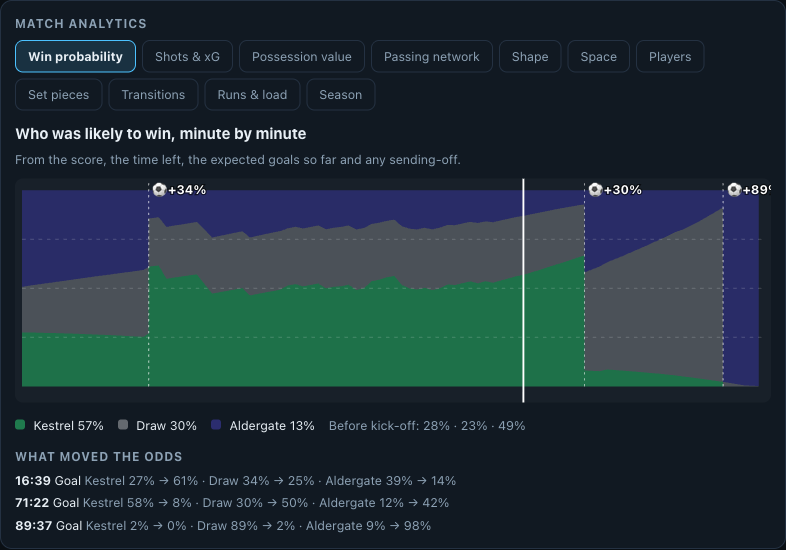

# Match analytics

The metrics that Opta, StatsBomb, SkillCorner, Second Spectrum and Impect publish, computed from the
synthetic feed. Each one is a deterministic function of events and tracking, goes through the same
evidence-pack, glossary and Verifier discipline as every other number in MatchMind, and is available three
ways: in the match center (**Match analytics** panel and live pitch graphics), through MCP tools
(`get_win_probability`, `get_key_actions` ... 24 tools in all) and as `analytics.json` in every replay package.



## What is implemented

| Idea | Provider analogue | What MatchMind computes | Where |
|---|---|---|---|
| **Win probability and leverage** | Opta win probability | Live P(win/draw/loss) from the score, time left, expected goals so far and red cards; every goal and red card carries the change in the evidence pack, and the Editor ranks goals by it | `analytics/winprob.py` |
| **Possession value** | StatsBomb OBV, Opta possession value, VAEP | Two logistic models predict scoring and conceding within ten actions; an action's value is the change in P(score) - P(concede). Gives most valuable actions, value by player, a player of the match | `analytics/vaep.py` |
| **Post-shot xG and keepers** | Opta xGOT, StatsBomb PSxG | xGOT from where in the goal mouth the shot went; goals prevented = xGOT faced - goals conceded; claims, sweeping, distribution | `analytics/xgot.py`, `goalkeepers.py` |
| **Shot map and xG race** | Opta, StatsBomb | Every shot with xG and xGOT; cumulative xG per team | `analytics/shots.py` |
| **Pitch control** | Second Spectrum, SkillCorner | Who would reach each cell first, from positions; control share, final-third control, and the space the opposition controls behind a defensive line | `tracking/control.py`, `insights.py` |
| **Packing and line-breaking passes** | Impect packing, SkillCorner line breaks | Opponents bypassed by each forward pass and the defensive lines it breaks, from positions at the moment of the pass | `tracking/analyzer.py` |
| **Passing networks** | Wyscout, Opta | Players at their average pass position, links by completed passes, per half | `analytics/networks.py` |
| **Formation from tracking** | SkillCorner, Opta | The shape each team actually took, out of possession and in possession, by matching average positions to a library of formations | `analytics/measured_shape.py` |
| **Off-ball runs** | SkillCorner off-ball runs | Runs in behind, overlaps and forwards dropping into midfield from player velocities, with whether the ball was played to the runner | `tracking/insights.py` |
| **Physical load** | SkillCorner physical, Catapult | Distance, high-speed running, sprint distance, accelerations, decelerations, a fatigue index from 15-minute blocks | `tracking/insights.py` |
| **Transitions and pressing** | StatsBomb counterpress, Opta | Counter-press regains within five seconds, high turnovers, fast breaks (a shot within 12 s), where teams press, what triggers it, PPDA by zone, and the size of the defending block (convex hull of the ten outfield players) | `analytics/transitions.py`, `pressing.py` |
| **Set-piece review** | Opta set-piece reports | Shots and xG per corner, free-kick and goal-kick routine; corners conceded by zonal versus man-marking | `analytics/setpieces.py` |
| **Season context and "Opta facts"** | Opta facts, previews | A simulated history gives the table, form, runs, head-to-head, records, and live milestones ("goal number 10 this season", "fastest goal in the league's history") | `analytics/season.py` |
| **Prediction** | Opta supercomputer | A Poisson model from expected goals for and against: win/draw/loss, expected goals, likeliest scores | `analytics/season.py` |
| **Radars and "plays like"** | StatsBomb radars, Wyscout | Per-90 numbers as percentiles among positional peers over the history; the three most similar players | `analytics/season.py` |
| **Broadcast graphics** | Opta Vision overlays | Pitch control shading, team-shape hulls and defensive lines, a live offside line, passing options, run trails (all drawn from the tracking frame), plus `pitch_graphic` overlays for offsides, runs, line-breaking passes and shot traces | `web/src/lib/layers.ts`, `agents/producer.py` |


## How each number is made, and how far to trust it

**Win probability.** Goals follow a Poisson process. A team's scoring rate starts at the league average
(fitted: 0.0135 goals per team-minute over 90 simulated matches, 95.8 minutes a match), scaled by its
pre-match strength, and is blended with the match's own xG as if the prior were 30 minutes of evidence. A red
card multiplies the ten-man side's rate by 0.78 and the other side's by 1.22; those two multipliers are
**priors** (a simulated league has too few sendings-off to estimate them). At 60 minutes the model's Brier
score is 0.351 against 0.678 for always predicting the pre-match odds (in-sample, 90 matches).

**Possession value.** 131,552 actions from 90 simulated matches; features are the action, where it started
and ended, whether it worked, the xG of a shot and the same for the two actions before it. AUC 0.787 for "scores
within ten actions" and 0.821 for "concedes". Fitted on synthetic data, so the *ranking* of actions is
meaningful but the absolute values are the simulator's.

**xGOT.** Shot placement is simulated (finishers beat the keeper toward the corners, keepers save more shots
at a comfortable height), so the model learns that relationship (AUC 0.89). That is a property of the
simulator rather than of real finishing, and says so in the data card.

**Pitch control.** A simplified time-to-reach model: each player is assumed able to cover 7 m/s, and a cell
goes to the team whose nearest player is sooner by a logistic of 2.2 per second. It ignores player velocity and
the ball, unlike published models. The browser implements the same formula (`web/src/lib/control.ts`) and a
shared fixture keeps both in step.

**Packing and line breaks.** Opponents (goalkeeper excluded) between the passer and the receiver in depth;
defenders are grouped into lines when more than 6.5 m separate them. A pass bypassing 10 or more opponents, or
breaking all three lines, gets a card (about five a match).

**Formation from tracking.** The ten players seen most are matched to every shape in the library by optimal
assignment, with a penalty when a player's listed position does not fit the slot. Honest accuracy against
the shapes the simulator was *designed* to produce, over 96 team-phases from 24 matches: the back-line count
agrees in 85%, the exact label in 39%. The gap is real play: a high-pressing 4-3-3 keeps its front line high
and measures as a 4-3-3 rather than the designed 4-5-1 block. Treat the output as "what the positions say",
not ground truth.

**Off-ball runs.** A run needs 1.2 seconds above 4.4 m/s (1.8 m/s for fullbacks, whose overlaps are a long
stride rather than a sprint) with a 0.6 s grace period, moving toward goal. In behind: crossing the offside
line and ending ahead of the ball; overlap: a fullback starting behind and ending ahead of and wider than the ball
carrier; drop: an attacker retreating at least 8 m toward the ball. Typical match: 10 to 35 runs in behind and 5
to 45 drops per team. Harbour's false nine produces more drops than any other club (about 45 a match against 7 to
30), and fullbacks told to overlap produce overlaps while Harbour's inverted ones do not.

**Physical load.** High-speed running from 19.8 km/h, sprints from 25 km/h, accelerations at 3 m/s^2 over one
second (a median of about 85 a player). The fatigue index is high-speed running in the last two 15-minute
blocks divided by the first block.

**Fast breaks.** A shot within 12 seconds of winning the ball in open play in the own 70% of the pitch, in six
passes or fewer (typically 1 to 3 a match); reaching the final third within 10 seconds is counted separately
as a quick entry.

**Season and prediction.** Everything is synthetic: 30 matches of last season and four rounds of this one,
simulated with each club's default style. Team strengths are expected goals for and against shrunk toward
the league mean as if each club had three league-average matches already. The three scripted fixtures are
round five.

**Milestones.** "Goal number N this season" (1, 5, 10, 15), hat-tricks, the fastest goal in the league's
history, and the end of a clean-sheet run of two or more matches.

## Where the analytics change what the system says

* Goals and red cards carry `win_prob` (before, after) in their evidence pack, so the explanation can say
  "win probability 64% to 92%", and salience scales with the swing.
* The Editor always tells a headline story (salience 0.6 or more) whatever the budget, and must-show moments
  no longer consume the budget meant for optional stories.
* Previews quote the model's prediction and the table; full-time recaps quote the biggest swing and choose the
  player of the match by possession value.
* New fact cards in English, Spanish and Turkish: line-breaking passes, runs, workload at half-time and
  full-time, milestones, set-piece routines.
* `pitch_graphic` overlays (see [overlay-contract.md](overlay-contract.md)) carry geometry in pitch metres so any
  renderer can draw an offside line, a run, a line-breaking pass or a shot trace.

## Regenerating the models and the history

```bash
uv run matchmind fit-models --matches 90   # win probability, possession value, post-shot xG -> data/league/models.json
uv run matchmind build-season              # last season and four rounds of this one -> data/league/season.json (about a minute)
uv run matchmind build-replay pressing-collapse
```

Run `fit-models` before `build-season` (the season is interpreted with the fitted models), and rebuild the
replays after either.

## Not built

* Pitch control with velocities and the ball (the published models use both).
* A hosted analytics service or Fabric lakehouse: the numbers are computed at build time and served as static
  JSON or through the Brain and MCP.
* Possession value and win probability fitted on real data; the pipeline is the same, the data is not available.
* Per-player cards for the physical-load fatigue index (it is in the panel and the MCP tool).
