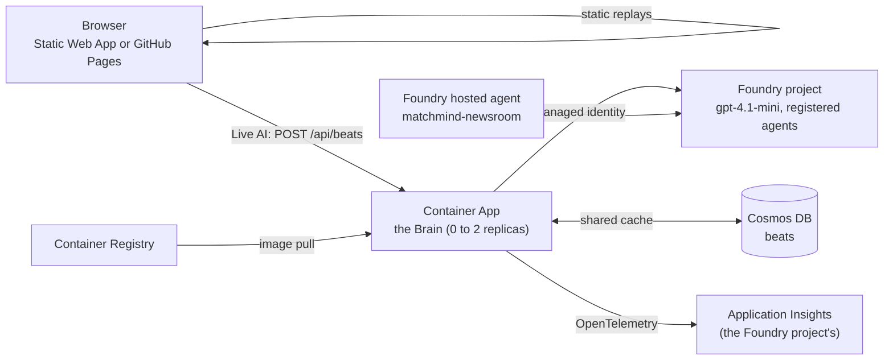

# Architecture

MatchMind is one Python package (`src/matchmind`) used by every deployment shape, plus a Brain service
(`apps/brain`) and a static web app (`web/`).

## Data flow

1. **Simulator** (`sim/`). A 5 Hz agent-based simulation of 22 players and a ball for a fictional
   six-club league. Style dials (press intensity and height, line height, width, tempo, directness,
   counter bias) drive movement, pressing, marking, transitions and decisions, so clubs differ in the data.
   Nine formations each have an attacking shape and a defensive block that a team glides between with the
   ball, club tags choose how the shape is played (fullbacks, pivot, false nine), and restarts are
   choreographed (corner routines, walls, short or long goal kicks, throw-in outlets; see
   [tactics.md](tactics.md)). Output: an event stream and tracking frames, as a data provider would deliver. Scenarios (YAML) script
   changes mid-match; the pipeline is never told about them.
2. **Tracking** (`tracking/`). Frames travel as 5-second gzip chunks (live) or one bundle (replay). The
   **physical analyzer** is incremental and reads only tracking and events: sprints, top speed, distance
   milestones, team shape, how closely the nearest defender closes the ball down, and per-pass/shot
   context (ball speed, pressure, lane blockage). Streaming and batch runs give identical output.
3. **Interpreter** (`intel/`). A streaming state machine. It merges late physics, computes window metrics,
   three indices (control vs chaos, pressure, rhythm, z-scored against measured league baselines), and
   detects moments. Each moment gets an **evidence pack** (see [metrics.md](metrics.md)).
4. **Agents.** Two paths over the same evidence packs and the same Verifier ([agents.md](agents.md)). The **workflow**
   (`agents/workflow.py`) chains Editor, Explainer, Storyteller and Localizer with retries; it builds the replay packages and takes tens
   of seconds per beat with a real model. The **fast path** (`agents/fast.py`) answers a live request inside five seconds: a rule-based
   Editor and Router, one Composer model call per cohort in parallel, the Verifier, a rule-based Repairer, and template text rendered
   first as the guaranteed answer.
5. **Overlay Producer** (`agents/producer.py`). Timing from the match clock, one lower-third at a time per
   cohort, late items dropped or turned into tickers, stat graphics shared across modes
   ([overlay-contract.md](overlay-contract.md)).
6. **Delivery.** A replay package (static JSON + one tracking bundle) played by the web app; the Brain service running the same agents
   on demand (`POST /api/beats`, [brain-api.md](brain-api.md)) and exposing the data through MCP; and the fast path served as a Microsoft
   Foundry hosted agent ([foundry.md](foundry.md)). The match center's **Live AI** switch is the Brain's client: it replaces a recorded
   overlay with the model's fresh one for the selected moment and keeps the recorded one if anything goes wrong.

## Key decisions

* **Code computes, models explain.** Numbers are exact, cheap and testable; models only choose and phrase.
* **Ports and adapters.** The pipeline touches storage, queues and models through small interfaces, so the
  same code runs locally (files, memory, an offline model) and on Azure.
* **Immutable workflow messages, mutually exclusive edge conditions.** A shared mutable message once made
  two branches fire during prototyping; the rule is now structural.
* **Cohorts, not viewers.** Text is generated once per distinct audience (mode, language, club side,
  followed player); cost grows with cohorts, not audience size.
* **Replay packages for judges.** Static files, no backend and no model at view time, plus a GitHub Pages
  mirror that survives an Azure outage.
* **The deadline is the design.** A live overlay has five seconds. The template text is rendered *first*, so there is always a verified
  answer; the model's text replaces it only if it arrives in time and passes the Verifier. Late, failed and rejected calls cost nothing but the
  upgrade. Nothing waits for a cancelled call.
* **Rules before models.** Choosing beats (Editor), choosing who gets a model call (Router), remembering verified text (Cache) and mending
  rejected text (Repairer) need no model, so they cost no tokens and no seconds. The model writes; code decides, checks and repairs.
* **Never block the event loop.** A single synchronous call that waits for a simulation (6 s on a laptop, 20 s on the container) froze the
  whole service, health checks and the five-second deadline timer included. Heavy work runs in worker threads, read endpoints serve
  the recorded files, and a test fails if a slow MCP tool stalls `/health`.
* **Cache only verified model text, in two layers.** Memory in front, Cosmos DB behind; keyed by match, moment, cohort, model and prompt
  version, so a change of either never serves old text. Cosmos can only make a request faster: every call is time-boxed and an error is a miss.
* **A public service guards itself.** Per-client rate limit, an in-flight cap, an admin key for the expensive options and a token-a-minute
  ceiling on the model deployment ([running-on-azure.md](running-on-azure.md)).
* **Agents are registered, traced and evaluated in Foundry.** The same prompts run as local agents or as versioned Foundry agents; the Brain
  refuses registered agents whose prompt version is stale. Traces and evaluations land in the Foundry project.

## Azure shape (Bicep in `infra/`)

Used by the app: Container Apps (the Brain, scales to zero, at most 2 replicas), Static Web Apps, Cosmos DB free tier (the shared cache),
Application Insights and Log Analytics (daily cap), the Container Registry, a budget with alerts, and the Foundry project (model, six registered
agents, the hosted agent, evaluations). Provisioned but not used yet: SignalR (free), Storage and Key Vault, which are the pieces of the event-driven
pipeline in the plan. A user-assigned managed identity holds every role assignment; there are no keys in configuration. What is deployed, how
it was verified and what went wrong on a free subscription: [running-on-azure.md](running-on-azure.md). Every setting: [configuration.md](configuration.md).
