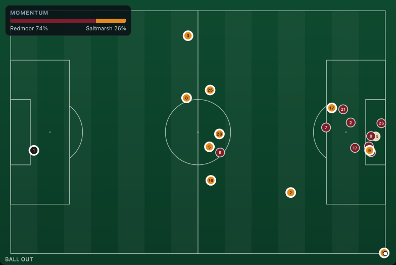
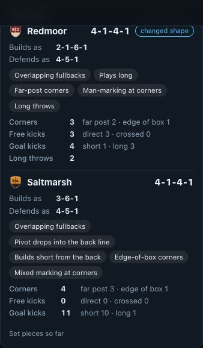

# Formations, tactics and set pieces

Football is not eleven players holding one shape. Teams change shape with the ball, play the same
formation in different ways, and rehearse their restarts. The simulator models all three, so the
tracking data the pipeline reads looks like modern European football instead of one stretched 4-4-2.

## Formations and the shapes they become

Nine formations are defined in [`src/matchmind/sim/tactics.py`](../src/matchmind/sim/tactics.py). Each has
three layouts for its ten outfield players: the nominal **base** (kick-offs, the team sheet), an
**attacking** shape and a defensive **block**. A team glides between the two (about 2.5 seconds) as
possession changes hands, so a 3-4-3 really does become a 5-4-1 when it loses the ball.

| Formation | Out of possession | In possession | Character |
|---|---|---|---|
| 4-3-3 | 4-5-1 | 2-3-5 | front three, one pivot, two eights |
| 4-2-3-1 | 4-4-1-1 | 2-4-4 | double pivot, a ten behind one striker |
| 4-4-2 | 4-4-2 | 2-4-4 | two banks of four, a strike pair |
| 4-1-4-1 | 4-5-1 | 2-3-5 | a lone holding midfielder screening the back four |
| 4-3-1-2 | 4-3-1-2 | 2-3-3-2 | a midfield diamond and two strikers |
| 3-5-2 | 5-3-2 | 3-3-4 | three centre-backs, wing-backs, two strikers |
| 3-4-3 | 5-4-1 | 3-2-5 | back three, wing-backs, a front three |
| 3-4-2-1 | 5-4-1 | 3-2-4-1 | back three, two tens in the half-spaces |
| 5-3-2 | 5-3-2 | 3-3-4 | a back five and a counter-attacking pair |

How far a team drops into its block depends on its pressing: a club that presses high keeps its nominal
front line out of possession, a club that defends deep commits fully to the block.

Measured from the tracking of simulated matches (average attack-frame position of each starter, over
three matches), clubs look different. Kestrel Vale's wing-backs stand about 21 m higher up the pitch with
the ball than without it, and 4 m from the touchline in possession against 12 m out of it. Harbour's
inverted fullbacks stand about 19 m from the touchline while Redmoor's overlapping ones stand 6 m from
it and 13 m higher. Harbour's false nine averages 55 m from his own goal against 73 m for Redmoor's
strikers. Saltmarsh's pivot sits 26 m out, level with their centre-backs at 24 m, so they build with a
back three.

## How a shape is played: tactic tags

On top of the formation, a club has tags (`Style` in `teams.py`). A tag changes the attacking layout and
how restarts are taken:

| Tag | Values | Effect |
|---|---|---|
| `fullbacks` | hold, overlap, inverted | overlapping fullbacks push to the touchline while the winger tucks in; inverted fullbacks step into midfield while the winger holds the line |
| `pivot` | stay, drop | the lone holding midfielder drops between the centre-backs to build with a back three |
| `striker` | target, false9 | a false nine drops into midfield and the wingers attack the space behind |
| `build_up` | short, mixed, long | goal kicks and restarts: build from the back or go long to a target man |
| `corners` | mixed, near, far, short, edge | the attacking corner routine the club prefers |
| `corner_defence` | zonal, man, mixed | how the club defends corners |
| `long_throws` | true, false | a throw-in specialist hurls it into the box |

The six clubs of the Lumen League are archetypes (fictional, like everything else): Harbour City play
positional football from a 4-3-3 with inverted fullbacks, a false nine, short goal kicks and short
corners; Northbridge Athletic press and counter from a 4-2-3-1 with overlapping fullbacks and man-marked
corners; Redmoor United are direct and physical in a 4-4-2 with long goal kicks, far-post corners and a
long throw; Kestrel Vale use a 3-4-3 with wing-backs for width; Aldergate Rovers defend in a 5-3-2 low
block and break; Saltmarsh Town build from a dropping pivot in a 4-1-4-1.

Scenarios can change shape mid-match (`formation: "5-3-2"` or `tags: {fullbacks: inverted}` in the
script). Players are re-assigned to the new slots by role fit; a sent-off player's slot goes to the most
advanced role, so ten men give up a forward. In `red-card-drama` Redmoor lose a defender, withdraw a
striker and reorganise from a 4-4-2 to a 4-1-4-1 while Saltmarsh go to a back three to push the
advantage; in `high-line-gamble` Aldergate switch from a back five to a back three to chase the game.

## Set pieces ([`setpieces.py`](../src/matchmind/sim/setpieces.py))

When play stops, both teams walk to a *plan* for that restart, made from the club's tags and written in
the taking team's attack frame.

| Restart | Routines | Positions |
|---|---|---|
| Corner | near post, far post, short, edge of the box | two centre-backs and four attackers in or at the box, the rest left upfield as a counter-attack screen; zonal defence (a line on the six-yard box, two on the posts, one at the penalty spot) or man-marking, with two defenders upfield either way |
| Free kick | direct, crossed, quick | direct: a wall of three to five at 9.5 m, the keeper covering the open post, a decoy over the ball and rebound hunters; crossed: attackers in the box against an offside line |
| Goal kick | short, long | short: centre-backs split wide inside the box, fullbacks to the touchline, the pivot between the lines, while the opposition presses to the edge of the box (never inside it); long: the team pushes up around a target man |
| Throw-in | short, long | three outlets (short, diagonal, back) that the opponent marks; a long-throw club crowds the box |
| Penalty | | everyone else outside the box and the arc |
| Kick-off | | both teams in their own halves, the defending team outside the centre circle |

Every routine is recorded on the event (`corner.attributes.routine`, `free_kick.attributes.wall` ...) the
way a data provider tags set pieces, shown as a small card in each viewer's language, and counted per
team in the match center's Tactics panel.

## What it cost, and what it taught

* **Realism had to be re-calibrated.** More attacking shapes raised shots and corners and lowered
  duels, fouls and pass completion; shot weighting, pressure and duel rates and pass choice were retuned
  until all 19 league averages were back in band (see [data-card.md](data-card.md)).
* **Shape changes tripped the tactical-shift detector.** It fired 5.9 times a match (it was 2.5), because
  a team's defensive line legitimately sits higher or deeper with the ball. The analyzer now samples
  defensive shape only while the opponent has the ball in the middle of the pitch, and the thresholds were
  re-derived from data (line change at least 7 m, width at least 10 m): about 0.7 false alarms a match,
  and the scripted line change is found in 17 of 20 seeds. See [metrics.md](metrics.md).
* **A latent template bug surfaced.** Claims were linked to evidence by number coincidence, so a 0.3 in one
  sentence could cite an unrelated metric that also read 0.3. A metric now counts as cited only when both
  its before and after values appear.
* **Not done:** recognising the formation from tracking (shapes are named from the layouts, not measured
  back from the frames), and showing the set-piece card before the kick instead of as it is taken.
